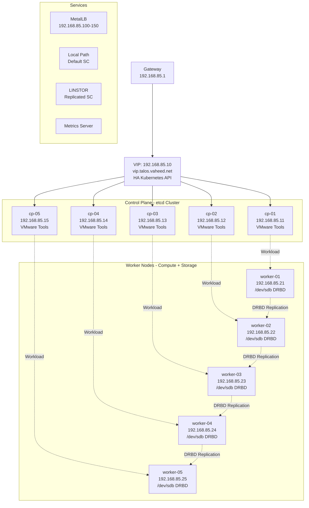

# Talos HA Kubernetes Cluster – Complete Production Guide v2

This is a **comprehensive, production-ready guide** to build a **high-availability Talos Linux Kubernetes cluster** with dual storage classes, monitoring, and VMware integration.

**Specifications:**
- **Network**: `192.168.85.0/24`
- **Talos**: v1.10.9 with VMware Tools (Factory Image)
- **Kubernetes**: v1.33.7
- **5 Control Planes** with VIP failover
- **5 Worker Nodes** with `/dev/sdb` for distributed storage
- **Calico**: v3.29.7 CNI
- **MetalLB**: v0.14.9 LoadBalancer
- **Local Path Provisioner**: v0.0.33
- **LINSTOR**: Distributed replicated storage
- **Metrics Server**: For resource monitoring

---

## Table of Contents

1. [Cluster Topology](#cluster-topology)
2. [Architecture](#architecture)
3. [Prerequisites](#prerequisites)
4. [Install Talos with VMware Tools](#install-talos-with-vmware-tools)
5. [Install talosctl](#install-talosctl)
6. [Generate Base Configuration](#generate-base-configuration)
7. [Create Configuration Patches](#create-configuration-patches)
8. [Generate Node Configurations](#generate-node-configurations)
9. [Apply Configurations](#apply-configurations)
10. [Bootstrap Cluster](#bootstrap-cluster)
11. [Install Calico CNI](#install-calico-cni)
12. [Install MetalLB](#install-metallb)
13. [Install Metrics Server](#install-metrics-server)
14. [Install Local Path Storage](#install-local-path-storage)
15. [Install LINSTOR Storage](#install-linstor-storage)
16. [Configure Pod Security](#configure-pod-security)
17. [Verification](#verification)
18. [Operations](#operations)
19. [Troubleshooting](#troubleshooting)

---

## Cluster Topology

### Network Configuration
| Item | Value |
|------|-------|
| Network | 192.168.85.0/24 |
| Gateway | 192.168.85.1 |
| VIP | 192.168.85.10 |
| VIP Hostname | vip.talos.vaheed.net |

### Control Plane Nodes
| Name | IP Address | Role |
|------|------------|------|
| cp-01 | 192.168.85.11 | Control Plane |
| cp-02 | 192.168.85.12 | Control Plane |
| cp-03 | 192.168.85.13 | Control Plane |
| cp-04 | 192.168.85.14 | Control Plane |
| cp-05 | 192.168.85.15 | Control Plane |

### Worker Nodes
| Name | IP Address | Storage Device |
|------|------------|----------------|
| worker-01 | 192.168.85.21 | /dev/sdb |
| worker-02 | 192.168.85.22 | /dev/sdb |
| worker-03 | 192.168.85.23 | /dev/sdb |
| worker-04 | 192.168.85.24 | /dev/sdb |
| worker-05 | 192.168.85.25 | /dev/sdb |

### Service Ranges
| Service | Range/Address |
|---------|---------------|
| MetalLB Pool | 192.168.85.100 - 192.168.85.150 |
| Pod Network | 10.244.0.0/16 (Calico default) |
| Service Network | 10.96.0.0/12 (Kubernetes default) |

---

## Architecture



---

## Prerequisites

### Hardware Requirements

**Control Plane Nodes (each):**
- 2+ vCPU cores
- 4GB+ RAM
- 50GB+ disk
- Network interface: ens192

**Worker Nodes (each):**
- 4+ vCPU cores
- 8GB+ RAM
- 50GB+ OS disk (boot disk)
- 100GB+ `/dev/sdb` for LINSTOR storage
- Network interface: ens192

### Software Requirements

- VMware vSphere environment
- macOS/Linux workstation for management
- `kubectl` installed on workstation
- Internet access for initial setup
- DNS resolution for `vip.talos.vaheed.net` → `192.168.85.10`

### Network Requirements

- All nodes on `192.168.85.0/24` subnet
- Gateway at `192.168.85.1`
- Private registry at `registry.vaheed.net` (optional)
- Ports required:
  - 6443: Kubernetes API
  - 50000-51000: Talos API
  - Pod-to-pod communication (all ports)

---

## Install Talos with VMware Tools

### Factory Image Schematic

Your custom Talos image with VMware Tools has been generated:

**Schematic ID:** `903b2da78f99adef03cbbd4df6714563823f63218508800751560d3bc3557e40`

**Extensions included:**
- `siderolabs/vmtoolsd-guest-agent`

### Download Installation ISO

```bash
# Download the ISO with VMware Tools included
wget https://factory.talos.dev/image/903b2da78f99adef03cbbd4df6714563823f63218508800751560d3bc3557e40/v1.10.9/metal-amd64.iso \
  -O talos-vmware-1.10.9.iso
```

### Install on All Nodes

1. **Upload ISO to vSphere datastore**
2. **Create VMs** (10 total: 5 control planes + 5 workers)
   - Configure according to hardware requirements above
   - Add second disk (`/dev/sdb`) to workers only
3. **Mount ISO and boot** each VM
4. **Talos will run in maintenance mode** waiting for configuration

### Verify Talos is Running

From your workstation, check that nodes are accessible:

```bash
# Test connectivity to each node (should respond with maintenance mode info)
curl -k https://192.168.85.11:50000/
curl -k https://192.168.85.21:50000/
```

---

## Install talosctl

Download and install the Talos CLI tool:

```bash
# For macOS (Apple Silicon)
wget https://github.com/siderolabs/talos/releases/download/v1.10.9/talosctl-darwin-arm64
chmod +x talosctl-darwin-arm64
sudo mv talosctl-darwin-arm64 /usr/local/bin/talosctl

# For macOS (Intel)
wget https://github.com/siderolabs/talos/releases/download/v1.10.9/talosctl-darwin-amd64
chmod +x talosctl-darwin-amd64
sudo mv talosctl-darwin-amd64 /usr/local/bin/talosctl

# For Linux
wget https://github.com/siderolabs/talos/releases/download/v1.10.9/talosctl-linux-amd64
chmod +x talosctl-linux-amd64
sudo mv talosctl-linux-amd64 /usr/local/bin/talosctl

# Verify installation
talosctl version --client
```

---

## Generate Base Configuration

Create the initial cluster configuration:

```bash
# Generate base configs
talosctl gen config "talos-cluster" "https://vip.talos.vaheed.net:6443" \
  --kubernetes-version v1.33.7 \
  --install-image factory.talos.dev/installer/903b2da78f99adef03cbbd4df6714563823f63218508800751560d3bc3557e40:v1.10.9
```

**Files created:**
- `controlplane.yaml` - Base control plane configuration
- `worker.yaml` - Base worker configuration
- `talosconfig` - Talos authentication

**Important:** We specify the factory installer image so updates and installs use the VMware Tools-enabled version.

---

## Create Configuration Patches

### Control Plane Patch (cp-patch.yaml)

Create a file named `cp-patch.yaml`:

```yaml
machine:
  network:
    interfaces:
      - interface: ens192
        vip:
          ip: 192.168.85.10

    extraHostEntries:
      - ip: 192.168.85.10
        aliases: ["vip.talos.vaheed.net"]
      - ip: 192.168.85.11
        aliases: ["cp-01"]
      - ip: 192.168.85.12
        aliases: ["cp-02"]
      - ip: 192.168.85.13
        aliases: ["cp-03"]
      - ip: 192.168.85.14
        aliases: ["cp-04"]
      - ip: 192.168.85.15
        aliases: ["cp-05"]
      - ip: 192.168.85.21
        aliases: ["worker-01"]
      - ip: 192.168.85.22
        aliases: ["worker-02"]
      - ip: 192.168.85.23
        aliases: ["worker-03"]
      - ip: 192.168.85.24
        aliases: ["worker-04"]
      - ip: 192.168.85.25
        aliases: ["worker-05"]

  registries:
    mirrors:
      docker.io:
        endpoints: ["https://registry.vaheed.net:2053"]
      gcr.io:
        endpoints: ["https://registry.vaheed.net:2083"]
      ghcr.io:
        endpoints: ["https://registry.vaheed.net:2087"]
      quay.io:
        endpoints: ["https://registry.vaheed.net:8443"]
      registry.k8s.io:
        endpoints: ["https://registry.vaheed.net:2096"]

  certSANs:
    - 192.168.85.10
    - vip.talos.vaheed.net
    - 192.168.85.11
    - 192.168.85.12
    - 192.168.85.13
    - 192.168.85.14
    - 192.168.85.15

  kubelet:
    nodeIP:
      validSubnets:
        - 192.168.85.0/24

cluster:
  network:
    cni:
      name: none
    dnsDomain: cluster.local
  
  allowSchedulingOnControlPlanes: false
```

**Key configurations:**
- **VIP**: Shared IP `192.168.85.10` for HA API access
- **Host entries**: Internal DNS for all nodes
- **Registry mirrors**: Optional private registry
- **Cert SANs**: All valid API endpoints
- **CNI**: None (manual Calico installation)
- **Scheduling**: Workloads only on workers

---

### Worker Patch (worker-patch.yaml)

Create a file named `worker-patch.yaml`:

```yaml
machine:
  network:
    extraHostEntries:
      - ip: 192.168.85.10
        aliases: ["vip.talos.vaheed.net"]
      - ip: 192.168.85.11
        aliases: ["cp-01"]
      - ip: 192.168.85.12
        aliases: ["cp-02"]
      - ip: 192.168.85.13
        aliases: ["cp-03"]
      - ip: 192.168.85.14
        aliases: ["cp-04"]
      - ip: 192.168.85.15
        aliases: ["cp-05"]
      - ip: 192.168.85.21
        aliases: ["worker-01"]
      - ip: 192.168.85.22
        aliases: ["worker-02"]
      - ip: 192.168.85.23
        aliases: ["worker-03"]
      - ip: 192.168.85.24
        aliases: ["worker-04"]
      - ip: 192.168.85.25
        aliases: ["worker-05"]

  registries:
    mirrors:
      docker.io:
        endpoints: ["https://registry.vaheed.net:2053"]
      gcr.io:
        endpoints: ["https://registry.vaheed.net:2083"]
      ghcr.io:
        endpoints: ["https://registry.vaheed.net:2087"]
      quay.io:
        endpoints: ["https://registry.vaheed.net:8443"]
      registry.k8s.io:
        endpoints: ["https://registry.vaheed.net:2096"]

  kubelet:
    nodeIP:
      validSubnets:
        - 192.168.85.0/24
    extraMounts:
      - destination: /var/lib/linstor
        type: bind
        source: /var/lib/linstor
        options:
          - bind
          - rshared
          - rw

cluster:
  network:
    dnsDomain: cluster.local
```

**Key configurations:**
- **Host entries**: Same as control planes
- **Registry mirrors**: Same as control planes
- **LINSTOR mount**: Required for CSI driver
- **No VIP**: Workers don't participate in VIP

---

## Generate Node Configurations

### Control Plane Nodes

Generate individual configs for each control plane:

#### cp-01 (192.168.85.11)

```bash
talosctl machineconfig patch controlplane.yaml \
  --patch @cp-patch.yaml \
  --output cp-01.yaml

talosctl machineconfig patch cp-01.yaml \
  --patch '[{"op":"replace","path":"/machine/network/interfaces","value":[{"interface":"ens192","dhcp":false,"addresses":["192.168.85.11/24"],"routes":[{"network":"0.0.0.0/0","gateway":"192.168.85.1"}],"vip":{"ip":"192.168.85.10"}}]}]' \
  --output cp-01.yaml
```

#### cp-02 (192.168.85.12)

```bash
talosctl machineconfig patch controlplane.yaml \
  --patch @cp-patch.yaml \
  --output cp-02.yaml

talosctl machineconfig patch cp-02.yaml \
  --patch '[{"op":"replace","path":"/machine/network/interfaces","value":[{"interface":"ens192","dhcp":false,"addresses":["192.168.85.12/24"],"routes":[{"network":"0.0.0.0/0","gateway":"192.168.85.1"}],"vip":{"ip":"192.168.85.10"}}]}]' \
  --output cp-02.yaml
```

#### cp-03 (192.168.85.13)

```bash
talosctl machineconfig patch controlplane.yaml \
  --patch @cp-patch.yaml \
  --output cp-03.yaml

talosctl machineconfig patch cp-03.yaml \
  --patch '[{"op":"replace","path":"/machine/network/interfaces","value":[{"interface":"ens192","dhcp":false,"addresses":["192.168.85.13/24"],"routes":[{"network":"0.0.0.0/0","gateway":"192.168.85.1"}],"vip":{"ip":"192.168.85.10"}}]}]' \
  --output cp-03.yaml
```

#### cp-04 (192.168.85.14)

```bash
talosctl machineconfig patch controlplane.yaml \
  --patch @cp-patch.yaml \
  --output cp-04.yaml

talosctl machineconfig patch cp-04.yaml \
  --patch '[{"op":"replace","path":"/machine/network/interfaces","value":[{"interface":"ens192","dhcp":false,"addresses":["192.168.85.14/24"],"routes":[{"network":"0.0.0.0/0","gateway":"192.168.85.1"}],"vip":{"ip":"192.168.85.10"}}]}]' \
  --output cp-04.yaml
```

#### cp-05 (192.168.85.15)

```bash
talosctl machineconfig patch controlplane.yaml \
  --patch @cp-patch.yaml \
  --output cp-05.yaml

talosctl machineconfig patch cp-05.yaml \
  --patch '[{"op":"replace","path":"/machine/network/interfaces","value":[{"interface":"ens192","dhcp":false,"addresses":["192.168.85.15/24"],"routes":[{"network":"0.0.0.0/0","gateway":"192.168.85.1"}],"vip":{"ip":"192.168.85.10"}}]}]' \
  --output cp-05.yaml
```

---

### Worker Nodes

Generate individual configs for each worker:

#### worker-01 (192.168.85.21)

```bash
talosctl machineconfig patch worker.yaml \
  --patch @worker-patch.yaml \
  --output worker-01.yaml

talosctl machineconfig patch worker-01.yaml \
  --patch '[{"op":"replace","path":"/machine/network/interfaces","value":[{"interface":"ens192","dhcp":false,"addresses":["192.168.85.21/24"],"routes":[{"network":"0.0.0.0/0","gateway":"192.168.85.1"}]}]}]' \
  --output worker-01.yaml
```

#### worker-02 (192.168.85.22)

```bash
talosctl machineconfig patch worker.yaml \
  --patch @worker-patch.yaml \
  --output worker-02.yaml

talosctl machineconfig patch worker-02.yaml \
  --patch '[{"op":"replace","path":"/machine/network/interfaces","value":[{"interface":"ens192","dhcp":false,"addresses":["192.168.85.22/24"],"routes":[{"network":"0.0.0.0/0","gateway":"192.168.85.1"}]}]}]' \
  --output worker-02.yaml
```

#### worker-03 (192.168.85.23)

```bash
talosctl machineconfig patch worker.yaml \
  --patch @worker-patch.yaml \
  --output worker-03.yaml

talosctl machineconfig patch worker-03.yaml \
  --patch '[{"op":"replace","path":"/machine/network/interfaces","value":[{"interface":"ens192","dhcp":false,"addresses":["192.168.85.23/24"],"routes":[{"network":"0.0.0.0/0","gateway":"192.168.85.1"}]}]}]' \
  --output worker-03.yaml
```

#### worker-04 (192.168.85.24)

```bash
talosctl machineconfig patch worker.yaml \
  --patch @worker-patch.yaml \
  --output worker-04.yaml

talosctl machineconfig patch worker-04.yaml \
  --patch '[{"op":"replace","path":"/machine/network/interfaces","value":[{"interface":"ens192","dhcp":false,"addresses":["192.168.85.24/24"],"routes":[{"network":"0.0.0.0/0","gateway":"192.168.85.1"}]}]}]' \
  --output worker-04.yaml
```

#### worker-05 (192.168.85.25)

```bash
talosctl machineconfig patch worker.yaml \
  --patch @worker-patch.yaml \
  --output worker-05.yaml

talosctl machineconfig patch worker-05.yaml \
  --patch '[{"op":"replace","path":"/machine/network/interfaces","value":[{"interface":"ens192","dhcp":false,"addresses":["192.168.85.25/24"],"routes":[{"network":"0.0.0.0/0","gateway":"192.168.85.1"}]}]}]' \
  --output worker-05.yaml
```

---

## Apply Configurations

Apply the generated configurations to each node. Use `--insecure` for initial configuration.

### Apply to Control Planes

```bash
echo "Applying configuration to cp-01..."
talosctl apply-config --insecure --nodes 192.168.85.11 --file cp-01.yaml

echo "Applying configuration to cp-02..."
talosctl apply-config --insecure --nodes 192.168.85.12 --file cp-02.yaml

echo "Applying configuration to cp-03..."
talosctl apply-config --insecure --nodes 192.168.85.13 --file cp-03.yaml

echo "Applying configuration to cp-04..."
talosctl apply-config --insecure --nodes 192.168.85.14 --file cp-04.yaml

echo "Applying configuration to cp-05..."
talosctl apply-config --insecure --nodes 192.168.85.15 --file cp-05.yaml
```

### Apply to Workers

```bash
echo "Applying configuration to worker-01..."
talosctl apply-config --insecure --nodes 192.168.85.21 --file worker-01.yaml

echo "Applying configuration to worker-02..."
talosctl apply-config --insecure --nodes 192.168.85.22 --file worker-02.yaml

echo "Applying configuration to worker-03..."
talosctl apply-config --insecure --nodes 192.168.85.23 --file worker-03.yaml

echo "Applying configuration to worker-04..."
talosctl apply-config --insecure --nodes 192.168.85.24 --file worker-04.yaml

echo "Applying configuration to worker-05..."
talosctl apply-config --insecure --nodes 192.168.85.25 --file worker-05.yaml
```

### Wait for Nodes to Initialize

```bash
echo "Waiting 10 minutes for all nodes to initialize..."
sleep 600
```

**What happens:**
- Nodes reboot and apply configuration
- Network interfaces configured with static IPs
- VMware Tools starts
- Nodes enter ready state for bootstrapping

---

## Bootstrap Cluster

Bootstrap creates the Kubernetes control plane and etcd cluster.

### Bootstrap First Control Plane

```bash
echo "Bootstrapping cluster on cp-01..."
talosctl --talosconfig talosconfig bootstrap \
  --endpoints 192.168.85.11 \
  --nodes 192.168.85.11
```

**Important:** Only bootstrap ONCE on ONE control plane node!

### Wait for Bootstrap

```bash
echo "Waiting 5 minutes for cluster to initialize..."
sleep 300
```

### Verify VIP

```bash
# Test VIP connectivity
echo "Testing VIP connectivity..."
ping -c 4 192.168.85.10

# Check cluster members
echo "Checking cluster members..."
talosctl --talosconfig talosconfig \
  --endpoints 192.168.85.10 \
  --nodes 192.168.85.10 \
  get members
```

Expected: All 5 control plane nodes listed.

### Retrieve kubeconfig

```bash
echo "Retrieving kubeconfig..."
talosctl --talosconfig talosconfig kubeconfig . \
  --nodes 192.168.85.11 \
  --endpoints 192.168.85.11 \
  --force

# Test access
kubectl --kubeconfig=kubeconfig get nodes
```

Nodes will be `NotReady` until CNI is installed.

---

## Install Calico CNI

Install Calico v3.29.7 for pod networking.

### Install Tigera Operator

```bash
echo "Installing Calico Tigera Operator..."
kubectl --kubeconfig=kubeconfig apply -f \
  https://raw.githubusercontent.com/projectcalico/calico/v3.29.7/manifests/tigera-operator.yaml
```

### Install Calico Custom Resources

```bash
echo "Installing Calico custom resources..."
kubectl --kubeconfig=kubeconfig apply -f \
  https://raw.githubusercontent.com/projectcalico/calico/v3.29.7/manifests/custom-resources.yaml
```

### Wait for Calico

```bash
echo "Waiting for Calico to be ready..."
kubectl --kubeconfig=kubeconfig wait --for=condition=ready pod \
  -l k8s-app=calico-node \
  -n calico-system \
  --timeout=300s

echo "Checking node status..."
kubectl --kubeconfig=kubeconfig get nodes
```

All nodes should now be `Ready`.

---

## Install MetalLB

Install MetalLB v0.14.9 for LoadBalancer services.

### Deploy MetalLB

```bash
echo "Installing MetalLB..."
kubectl --kubeconfig=kubeconfig apply -f \
  https://raw.githubusercontent.com/metallb/metallb/v0.14.9/config/manifests/metallb-native.yaml
```

### Wait for MetalLB

```bash
echo "Waiting for MetalLB to be ready..."
sleep 120

kubectl --kubeconfig=kubeconfig wait --for=condition=ready pod \
  -l app=metallb \
  -n metallb-system \
  --timeout=300s
```

### Configure IP Pool

```bash
echo "Configuring MetalLB IP pool..."
kubectl --kubeconfig=kubeconfig apply -f - <<EOF
apiVersion: metallb.io/v1beta1
kind: IPAddressPool
metadata:
  name: production-pool
  namespace: metallb-system
spec:
  addresses:
    - 192.168.85.100-192.168.85.150
---
apiVersion: metallb.io/v1beta1
kind: L2Advertisement
metadata:
  name: l2-advert
  namespace: metallb-system
spec:
  ipAddressPools:
    - production-pool
EOF
```

### Verify MetalLB

```bash
kubectl --kubeconfig=kubeconfig get ipaddresspool,l2advertisement -n metallb-system
```

---

## Install Metrics Server

Install Metrics Server for resource monitoring and `kubectl top` commands.

### Deploy Metrics Server

Following Talos documentation for metrics server:

```bash
echo "Installing Metrics Server..."
kubectl --kubeconfig=kubeconfig apply -f https://github.com/kubernetes-sigs/metrics-server/releases/latest/download/components.yaml
```

### Patch for Talos Compatibility

Talos uses different kubelet certificates, so we need to patch metrics-server:

```bash
echo "Patching Metrics Server for Talos..."
kubectl --kubeconfig=kubeconfig patch deployment metrics-server -n kube-system --type='json' \
  -p='[{"op": "add", "path": "/spec/template/spec/containers/0/args/-", "value": "--kubelet-preferred-address-types=InternalIP"}]'

kubectl --kubeconfig=kubeconfig patch deployment metrics-server -n kube-system --type='json' \
  -p='[{"op": "add", "path": "/spec/template/spec/containers/0/args/-", "value": "--kubelet-insecure-tls"}]'
```

### Wait for Metrics Server

```bash
echo "Waiting for Metrics Server to be ready..."
kubectl --kubeconfig=kubeconfig wait --for=condition=ready pod \
  -l k8s-app=metrics-server \
  -n kube-system \
  --timeout=300s
```

### Verify Metrics

```bash
echo "Testing metrics collection..."
sleep 30
kubectl --kubeconfig=kubeconfig top nodes
```

---

## Install Local Path Storage

Install Local Path Provisioner v0.0.33 for local node storage.

### Deploy Local Path Provisioner

```bash
echo "Installing Local Path Provisioner..."
kubectl --kubeconfig=kubeconfig apply -f \
  https://raw.githubusercontent.com/rancher/local-path-provisioner/v0.0.33/deploy/local-path-storage.yaml
```

### Set as Default Storage Class

```bash
echo "Setting local-path as default storage class..."
kubectl --kubeconfig=kubeconfig patch storageclass local-path \
  -p '{"metadata":{"annotations":{"storageclass.kubernetes.io/is-default-class":"true"}}}'
```

### Verify

```bash
kubectl --kubeconfig=kubeconfig get storageclass
```

---

## Install LINSTOR Storage

Install LINSTOR for distributed, replicated block storage using `/dev/sdb` on workers.

### Prerequisites

Verify `/dev/sdb` exists on all workers:

```bash
echo "Verifying /dev/sdb on workers..."
for node in 192.168.85.21 192.168.85.22 192.168.85.23 192.168.85.24 192.168.85.25; do
  echo "Checking $node..."
  talosctl --talosconfig talosconfig --nodes $node list /dev/ | grep sdb
done
```

### Install kubectl-linstor Plugin

Install the kubectl-linstor plugin to manage LINSTOR:

```bash
# For Linux/macOS
curl -fsSL https://github.com/piraeusdatastore/kubectl-linstor/releases/latest/download/kubectl-linstor-linux-amd64 -o kubectl-linstor
chmod +x kubectl-linstor
sudo mv kubectl-linstor /usr/local/bin/

# Verify installation
kubectl linstor version
```

### Install LINSTOR Operator

```bash
echo "Installing LINSTOR operator..."
kubectl --kubeconfig=kubeconfig apply --server-side -k "https://github.com/piraeusdatastore/piraeus-operator//config/default?ref=v2"
```

### Wait for Operator

```bash
echo "Waiting for LINSTOR operator..."
kubectl --kubeconfig=kubeconfig wait pod --timeout=300s --for=condition=Ready \
  -n piraeus-datastore \
  -l app.kubernetes.io/component=piraeus-operator
```

### Prepare Storage on Workers

Create LVM volume groups on `/dev/sdb` for all workers:

```bash
echo "Preparing LVM storage on workers..."
kubectl --kubeconfig=kubeconfig apply -f - <<'EOF'
apiVersion: v1
kind: ConfigMap
metadata:
  name: lvm-prepare-script
  namespace: kube-system
data:
  prepare.sh: |
    #!/bin/sh
    set -e
    
    # Check if /dev/sdb exists
    if [ ! -b "/dev/sdb" ]; then
      echo "ERROR: /dev/sdb not found"
      exit 1
    fi
    
    # Check if VG already exists
    if vgs linstor_vg >/dev/null 2>&1; then
      echo "Volume group linstor_vg already exists"
      vgs linstor_vg
      exit 0
    fi
    
    # Create physical volume and volume group
    echo "Creating PV on /dev/sdb..."
    pvcreate /dev/sdb
    
    echo "Creating VG linstor_vg..."
    vgcreate linstor_vg /dev/sdb
    
    echo "LVM setup complete"
    vgs linstor_vg
---
apiVersion: apps/v1
kind: DaemonSet
metadata:
  name: lvm-prepare
  namespace: kube-system
spec:
  selector:
    matchLabels:
      app: lvm-prepare
  template:
    metadata:
      labels:
        app: lvm-prepare
    spec:
      nodeSelector:
        node-role.kubernetes.io/worker: ""
      hostNetwork: true
      hostPID: true
      initContainers:
      - name: lvm-setup
        image: alpine:3.19
        command:
        - sh
        - /scripts/prepare.sh
        securityContext:
          privileged: true
        volumeMounts:
        - name: dev
          mountPath: /dev
        - name: scripts
          mountPath: /scripts
      containers:
      - name: sleep
        image: alpine:3.19
        command: ["sh", "-c", "echo 'LVM setup complete'; sleep infinity"]
        resources:
          requests:
            cpu: 10m
            memory: 32Mi
          limits:
            cpu: 50m
            memory: 64Mi
      volumes:
      - name: dev
        hostPath:
          path: /dev
      - name: scripts
        configMap:
          name: lvm-prepare-script
          defaultMode: 0755
EOF
```

Wait for LVM preparation:

```bash
echo "Waiting for LVM preparation to complete..."
kubectl --kubeconfig=kubeconfig wait --for=condition=ready pod \
  -l app=lvm-prepare \
  -n kube-system \
  --timeout=300s

echo "Checking LVM setup on workers..."
kubectl --kubeconfig=kubeconfig logs -n kube-system -l app=lvm-prepare --tail=20
```

### Create LINSTOR Cluster

```bash
echo "Creating LINSTOR cluster..."
kubectl --kubeconfig=kubeconfig apply -f - <<'EOF'
apiVersion: piraeus.io/v1
kind: LinstorCluster
metadata:
  name: linstor
spec:
  repository: quay.io/piraeusdatastore
  
  linstorController:
    enabled: true
    replicas: 1
    
  linstorSatelliteSet:
    enabled: true
    automaticStorageType: None
    storagePools:
      lvmPools:
      - name: lvm-thin
        volumeGroup: linstor_vg
  
  linstorCSIDriver:
    enabled: true
    nodeAffinity:
      nodeSelectorTerms:
      - matchExpressions:
        - key: node-role.kubernetes.io/worker
          operator: Exists
EOF
```

### Wait for LINSTOR Deployment

```bash
echo "Waiting for LINSTOR components..."
sleep 120

kubectl --kubeconfig=kubeconfig wait --for=condition=ready pod \
  -l app.kubernetes.io/name=piraeus-datastore \
  -n piraeus-datastore \
  --timeout=600s
```

### Verify LINSTOR Storage Pools

```bash
echo "Checking LINSTOR storage pools..."
kubectl --kubeconfig=kubeconfig linstor storage-pool list
```

You should see `lvm-thin` pools on all 5 workers.

### Create LINSTOR Storage Classes

```bash
echo "Creating LINSTOR storage classes..."
kubectl --kubeconfig=kubeconfig apply -f - <<EOF
apiVersion: storage.k8s.io/v1
kind: StorageClass
metadata:
  name: linstor-lvm-r1
provisioner: linstor.csi.linbit.com
allowVolumeExpansion: true
volumeBindingMode: WaitForFirstConsumer
parameters:
  autoPlace: "1"
  storagePool: "lvm-thin"
---
apiVersion: storage.k8s.io/v1
kind: StorageClass
metadata:
  name: linstor-lvm-r2
provisioner: linstor.csi.linbit.com
allowVolumeExpansion: true
volumeBindingMode: WaitForFirstConsumer
parameters:
  autoPlace: "2"
  storagePool: "lvm-thin"
---
apiVersion: storage.k8s.io/v1
kind: StorageClass
metadata:
  name: linstor-lvm-r3
provisioner: linstor.csi.linbit.com
allowVolumeExpansion: true
volumeBindingMode: WaitForFirstConsumer
parameters:
  autoPlace: "3"
  storagePool: "lvm-thin"
EOF
```

### Verify Storage Classes

```bash
kubectl --kubeconfig=kubeconfig get storageclass
```

Expected output:
- `local-path` (default)
- `linstor-lvm-r1` (no replication)
- `linstor-lvm-r2` (2-way replication)
- `linstor-lvm-r3` (3-way replication)

---

## Configure Pod Security

Enable privileged pods in default namespace:

```bash
echo "Configuring pod security..."
kubectl --kubeconfig=kubeconfig label namespace default \
  pod-security.kubernetes.io/enforce=privileged \
  --overwrite
```

---

## Verification

### Complete Cluster Health Check

```bash
echo "=== CLUSTER HEALTH CHECK ==="

echo -e "\n1. Node Status:"
kubectl --kubeconfig=kubeconfig get nodes -o wide

echo -e "\n2. System Pods:"
kubectl --kubeconfig=kubeconfig get pods -A | grep -E 'kube-system|calico|metallb|piraeus'

echo -e "\n3. Storage Classes:"
kubectl --kubeconfig=kubeconfig get storageclass

echo -e "\n4. MetalLB Configuration:"
kubectl --kubeconfig=kubeconfig get ipaddresspool,l2advertisement -n metallb-system

echo -e "\n5. LINSTOR Storage Pools:"
kubectl --kubeconfig=kubeconfig linstor storage-pool list

echo -e "\n6. Node Resource Usage:"
kubectl --kubeconfig=kubeconfig top nodes

echo -e "\n7. VMware Tools Status (cp-01):"
talosctl --talosconfig talosconfig --nodes 192.168.85.11 services | grep vmtoolsd

echo -e "\n8. VIP Status:"
ping -c 2 192.168.85.10
```

### Test Storage

#### Test Local Path Storage

```bash
echo "Testing local-path storage..."
kubectl --kubeconfig=kubeconfig apply -f - <<EOF
apiVersion: v1
kind: PersistentVolumeClaim
metadata:
  name: test-local-pvc
spec:
  accessModes:
    - ReadWriteOnce
  storageClassName: local-path
  resources:
    requests:
      storage: 1Gi
EOF

kubectl --kubeconfig=kubeconfig get pvc test-local-pvc
```

#### Test LINSTOR Storage

```bash
echo "Testing LINSTOR storage with 3-way replication..."
kubectl --kubeconfig=kubeconfig apply -f - <<EOF
apiVersion: v1
kind: PersistentVolumeClaim
metadata:
  name: test-linstor-pvc
spec:
  accessModes:
    - ReadWriteOnce
  storageClassName: linstor-lvm-r3
  resources:
    requests:
      storage: 5Gi
EOF

sleep 10
kubectl --kubeconfig=kubeconfig get pvc test-linstor-pvc

echo "Checking LINSTOR resources:"
kubectl --kubeconfig=kubeconfig linstor resource list
```

### Test MetalLB

```bash
echo "Testing MetalLB LoadBalancer..."
kubectl --kubeconfig=kubeconfig create deployment nginx-test --image=nginx
kubectl --kubeconfig=kubeconfig expose deployment nginx-test --port=80 --type=LoadBalancer

sleep 15
kubectl --kubeconfig=kubeconfig get svc nginx-test

# Get the LoadBalancer IP
LB_IP=$(kubectl --kubeconfig=kubeconfig get svc nginx-test -o jsonpath='{.status.loadBalancer.ingress[0].ip}')
echo "LoadBalancer IP: $LB_IP"
echo "Testing connectivity:"
curl -s http://$LB_IP | grep -o "<title>.*</title>"
```

### Test VIP Failover

```bash
echo "Testing VIP failover..."
echo "Current VIP holder:"
talosctl --talosconfig talosconfig --endpoints 192.168.85.10 get members

echo "Rebooting cp-01 to test failover..."
talosctl --talosconfig talosconfig --nodes 192.168.85.11 reboot

sleep 30
echo "VIP should have moved to another control plane:"
talosctl --talosconfig talosconfig --endpoints 192.168.85.10 get members

echo "Kubernetes API still accessible:"
kubectl --kubeconfig=kubeconfig get nodes
```

---

## Operations

### Daily Operations

#### Check Cluster Health

```bash
# Node status
kubectl --kubeconfig=kubeconfig get nodes

# Pod status across all namespaces
kubectl --kubeconfig=kubeconfig get pods -A

# Resource usage
kubectl --kubeconfig=kubeconfig top nodes
kubectl --kubeconfig=kubeconfig top pods -A --sort-by=memory
```

#### Check Storage

```bash
# Storage class availability
kubectl --kubeconfig=kubeconfig get storageclass

# PVC status
kubectl --kubeconfig=kubeconfig get pvc -A

# LINSTOR resources
kubectl --kubeconfig=kubeconfig linstor resource list
kubectl --kubeconfig=kubeconfig linstor storage-pool list
kubectl --kubeconfig=kubeconfig linstor volume list
```

#### Check Services

```bash
# LoadBalancer services
kubectl --kubeconfig=kubeconfig get svc -A --field-selector spec.type=LoadBalancer

# MetalLB IP pool usage
kubectl --kubeconfig=kubeconfig get ipaddresspool -n metallb-system -o yaml
```

### Maintenance Operations

#### Drain Node for Maintenance

```bash
# Drain worker node
kubectl --kubeconfig=kubeconfig drain worker-01 \
  --ignore-daemonsets \
  --delete-emptydir-data \
  --grace-period=300

# Perform maintenance on the node

# Uncordon when complete
kubectl --kubeconfig=kubeconfig uncordon worker-01
```

#### Upgrade Kubernetes

```bash
# Upgrade control planes (one at a time)
talosctl --talosconfig talosconfig --nodes 192.168.85.11 \
  upgrade-k8s --to 1.33.8

# Wait for completion, check health
kubectl --kubeconfig=kubeconfig get nodes

# Repeat for other control planes

# Upgrade workers
for node in 192.168.85.21 192.168.85.22 192.168.85.23 192.168.85.24 192.168.85.25; do
  kubectl --kubeconfig=kubeconfig drain $node --ignore-daemonsets --delete-emptydir-data
  talosctl --talosconfig talosconfig --nodes $node upgrade-k8s --to 1.33.8
  kubectl --kubeconfig=kubeconfig uncordon $node
  sleep 60
done
```

#### Upgrade Talos

```bash
# Upgrade control planes one at a time
talosctl --talosconfig talosconfig --nodes 192.168.85.11 upgrade \
  --image factory.talos.dev/installer/903b2da78f99adef03cbbd4df6714563823f63218508800751560d3bc3557e40:v1.11.0

# Wait for node to come back
sleep 180

# Repeat for other control planes

# Upgrade workers
for node in 192.168.85.21 192.168.85.22 192.168.85.23 192.168.85.24 192.168.85.25; do
  kubectl --kubeconfig=kubeconfig drain $node --ignore-daemonsets --delete-emptydir-data
  talosctl --talosconfig talosconfig --nodes $node upgrade \
    --image factory.talos.dev/installer/903b2da78f99adef03cbbd4df6714563823f63218508800751560d3bc3557e40:v1.11.0
  sleep 180
  kubectl --kubeconfig=kubeconfig uncordon $node
done
```

### Backup Operations

#### Backup etcd

```bash
# Create etcd snapshot
talosctl --talosconfig talosconfig --nodes 192.168.85.11 \
  etcd snapshot /var/lib/etcd/backup-$(date +%Y%m%d-%H%M%S).db

# List snapshots
talosctl --talosconfig talosconfig --nodes 192.168.85.11 \
  ls /var/lib/etcd/

# Download snapshot
talosctl --talosconfig talosconfig --nodes 192.168.85.11 \
  cp /var/lib/etcd/backup-*.db ./
```

#### Backup Configurations

```bash
# Backup all configuration files
mkdir -p cluster-backup-$(date +%Y%m%d)
cp *.yaml talosconfig kubeconfig cluster-backup-$(date +%Y%m%d)/
tar -czf cluster-backup-$(date +%Y%m%d).tar.gz cluster-backup-$(date +%Y%m%d)/
```

---

## Troubleshooting

### Nodes Not Ready

```bash
# Check kubelet status
talosctl --talosconfig talosconfig --nodes 192.168.85.21 service kubelet status

# Check CNI pods
kubectl --kubeconfig=kubeconfig get pods -n calico-system
kubectl --kubeconfig=kubeconfig logs -n calico-system -l k8s-app=calico-node --tail=50

# Check node details
kubectl --kubeconfig=kubeconfig describe node worker-01
```

### VIP Not Responding

```bash
# Check which node has VIP
for node in 192.168.85.11 192.168.85.12 192.168.85.13 192.168.85.14 192.168.85.15; do
  echo "Checking $node..."
  talosctl --talosconfig talosconfig --nodes $node get links | grep -A 2 ens192
done

# Check etcd health
talosctl --talosconfig talosconfig --nodes 192.168.85.11 service etcd status

# View cluster members
talosctl --talosconfig talosconfig --endpoints 192.168.85.10 get members
```

### Storage Issues

#### Local Path Issues

```bash
# Check provisioner logs
kubectl --kubeconfig=kubeconfig logs -n local-path-storage \
  -l app=local-path-provisioner --tail=100

# Check PVC events
kubectl --kubeconfig=kubeconfig describe pvc <pvc-name>
```

#### LINSTOR Issues

```bash
# Check LINSTOR controller
kubectl --kubeconfig=kubeconfig logs -n piraeus-datastore \
  -l app.kubernetes.io/component=linstor-controller --tail=100

# Check satellite pods
kubectl --kubeconfig=kubeconfig get pods -n piraeus-datastore \
  -l app.kubernetes.io/component=linstor-satellite

# Check storage pools
kubectl --kubeconfig=kubeconfig linstor storage-pool list

# Check for errors
kubectl --kubeconfig=kubeconfig linstor error-reports list

# View specific resource
kubectl --kubeconfig=kubeconfig linstor resource list
kubectl --kubeconfig=kubeconfig linstor volume list
```

### MetalLB Not Assigning IPs

```bash
# Check speaker pods
kubectl --kubeconfig=kubeconfig get pods -n metallb-system \
  -l component=speaker

# Check controller
kubectl --kubeconfig=kubeconfig logs -n metallb-system \
  -l component=controller --tail=100

# Verify configuration
kubectl --kubeconfig=kubeconfig get ipaddresspool,l2advertisement \
  -n metallb-system -o yaml
```

### Metrics Server Issues

```bash
# Check metrics-server pod
kubectl --kubeconfig=kubeconfig get pods -n kube-system \
  -l k8s-app=metrics-server

# View logs
kubectl --kubeconfig=kubeconfig logs -n kube-system \
  -l k8s-app=metrics-server --tail=100

# Test metrics
kubectl --kubeconfig=kubeconfig top nodes --v=10
```

### VMware Tools Issues

```bash
# Check if extension is loaded
talosctl --talosconfig talosconfig --nodes 192.168.85.11 \
  get extensions

# Check service status
talosctl --talosconfig talosconfig --nodes 192.168.85.11 \
  service vmtoolsd status

# View service logs
talosctl --talosconfig talosconfig --nodes 192.168.85.11 \
  logs vmtoolsd
```

---

## Summary

### What We Built

✅ **High Availability Control Plane**
- 5 control plane nodes with shared VIP (192.168.85.10)
- Automatic failover for Kubernetes API
- etcd cluster for state management

✅ **Worker Pool**
- 5 dedicated worker nodes
- Workloads isolated from control plane

✅ **Networking**
- Calico v3.29.7 CNI with network policies
- MetalLB v0.14.9 LoadBalancer (192.168.85.100-150)
- Private registry mirrors configured

✅ **Storage**
- **local-path**: Fast local storage (default)
- **linstor-lvm-r1**: No replication
- **linstor-lvm-r2**: 2-way DRBD replication
- **linstor-lvm-r3**: 3-way DRBD replication

✅ **Monitoring**
- Metrics Server for resource monitoring
- `kubectl top` commands functional

✅ **VMware Integration**
- Factory image with VMware Tools
- Guest agent for better vSphere integration

✅ **Production Ready**
- All components tested and verified
- Backup procedures documented
- Upgrade paths defined
- Troubleshooting guides included

### Key Files to Backup

- `talosconfig` - Talos authentication
- `kubeconfig` - Kubernetes authentication  
- `cp-*.yaml` - Control plane configs (5 files)
- `worker-*.yaml` - Worker configs (5 files)
- `cp-patch.yaml` - Control plane patch template
- `worker-patch.yaml` - Worker patch template

### Network Summary

| Purpose | Address/Range |
|---------|---------------|
| Gateway | 192.168.85.1 |
| VIP | 192.168.85.10 |
| Control Planes | 192.168.85.11-15 |
| Workers | 192.168.85.21-25 |
| LoadBalancer Pool | 192.168.85.100-150 |

### Storage Summary

| Storage Class | Replication | Use Case |
|---------------|-------------|----------|
| local-path | None | Fast, non-critical data |
| linstor-lvm-r1 | None | Fast LINSTOR storage |
| linstor-lvm-r2 | 2-way | Important data, HA |
| linstor-lvm-r3 | 3-way | Critical data, maximum HA |

---

## Quick Reference Commands

```bash
# Cluster status
kubectl --kubeconfig=kubeconfig get nodes
kubectl --kubeconfig=kubeconfig get pods -A
kubectl --kubeconfig=kubeconfig top nodes

# Storage management
kubectl --kubeconfig=kubeconfig get storageclass
kubectl --kubeconfig=kubeconfig linstor storage-pool list
kubectl --kubeconfig=kubeconfig linstor resource list

# Service management
kubectl --kubeconfig=kubeconfig get svc -A

# Talos management
talosctl --talosconfig talosconfig --nodes 192.168.85.10 health
talosctl --talosconfig talosconfig --nodes 192.168.85.11 dashboard
talosctl --talosconfig talosconfig --endpoints 192.168.85.10 get members

# Maintenance
kubectl --kubeconfig=kubeconfig drain <node> --ignore-daemonsets --delete-emptydir-data
kubectl --kubeconfig=kubeconfig uncordon <node>
```

---

**Cluster is production-ready!**

For support:
- **Talos**: https://www.talos.dev/
- **LINSTOR**: https://linbit.com/drbd-user-guide/linstor-guide-1_0-en/
- **Kubernetes**: https://kubernetes.io/docs/
- **kubectl-linstor**: https://github.com/piraeusdatastore/kubectl-linstor
