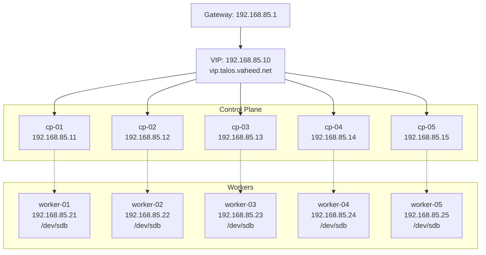

# Talos HA Kubernetes Cluster – Complete Production Guide

This is a **comprehensive, step-by-step guide** to build a **production-grade Talos Linux Kubernetes cluster** with high availability, dual storage classes, and private registry mirrors.

**Updated specifications:**
- Network: `192.168.85.0/24`
- 5 Control Planes with VIP
- 5 Worker Nodes
- Calico v3.29.7
- MetalLB v0.14.9
- Local Path Provisioner v0.0.33
- LINSTOR distributed storage
- VMware Tools integration
- Kubernetes v1.33.7

---

## Table of Contents

1. [Cluster Topology](#cluster-topology)
2. [Architecture Diagram](#architecture-diagram)
3. [Prerequisites](#prerequisites)
4. [Install talosctl](#install-talosctl)
5. [Generate Base Configuration](#generate-base-configuration)
6. [VMware Tools Extension](#vmware-tools-extension)
7. [Control Plane Configuration](#control-plane-configuration)
8. [Worker Node Configuration](#worker-node-configuration)
9. [Generate Final Configurations](#generate-final-configurations)
10. [Apply Configurations](#apply-configurations)
11. [Bootstrap Cluster](#bootstrap-cluster)
12. [Install Calico CNI](#install-calico-cni)
13. [Install MetalLB](#install-metallb)
14. [Install Local Path Storage](#install-local-path-storage)
15. [Install LINSTOR Storage](#install-linstor-storage)
16. [Configure Pod Security](#configure-pod-security)
17. [Verification](#verification)

---

## Cluster Topology

### Network Configuration
| Item | Value |
|------|-------|
| Network | 192.168.85.0/24 |
| Gateway | 192.168.85.1 |
| VIP | 192.168.85.10 |
| VIP Hostname | vip.talos.vaheed.net |

### Control Plane Nodes
| Name | IP Address |
|------|------------|
| cp-01 | 192.168.85.11 |
| cp-02 | 192.168.85.12 |
| cp-03 | 192.168.85.13 |
| cp-04 | 192.168.85.14 |
| cp-05 | 192.168.85.15 |

### Worker Nodes
| Name | IP Address |
|------|------------|
| worker-01 | 192.168.85.21 |
| worker-02 | 192.168.85.22 |
| worker-03 | 192.168.85.23 |
| worker-04 | 192.168.85.24 |
| worker-05 | 192.168.85.25 |

### MetalLB LoadBalancer Pool
| Pool Name | IP Range |
|-----------|----------|
| production-pool | 192.168.85.100 - 192.168.85.150 |

---

## Architecture Diagram



---

## Prerequisites

### Hardware Requirements
- **Control Planes**: 5 VMs with 2+ CPU cores, 4GB+ RAM
- **Workers**: 5 VMs with 4+ CPU cores, 8GB+ RAM
- **Additional disk on workers**: `/dev/sdb` for LINSTOR storage (minimum 50GB per node)

### Software Requirements
- Talos Linux v1.10.9 installed on all nodes
- Static IP networking configured
- macOS/Linux workstation for management
- `kubectl` installed on workstation
- VMware environment (for VMware Tools integration)

### Network Requirements
- All nodes on `192.168.85.0/24` network
- Gateway at `192.168.85.1`
- DNS resolution for `vip.talos.vaheed.net` → `192.168.85.10`
- Private registry at `registry.vaheed.net` (various ports)

---

## Install talosctl

Download and install the Talos CLI tool on your workstation:

```bash
# For macOS (Apple Silicon)
wget https://github.com/siderolabs/talos/releases/download/v1.10.9/talosctl-darwin-arm64
chmod +x talosctl-darwin-arm64
sudo mv talosctl-darwin-arm64 /usr/local/bin/talosctl

# For macOS (Intel)
wget https://github.com/siderolabs/talos/releases/download/v1.10.9/talosctl-darwin-amd64
chmod +x talosctl-darwin-amd64
sudo mv talosctl-darwin-amd64 /usr/local/bin/talosctl

# For Linux
wget https://github.com/siderolabs/talos/releases/download/v1.10.9/talosctl-linux-amd64
chmod +x talosctl-linux-amd64
sudo mv talosctl-linux-amd64 /usr/local/bin/talosctl

# Verify installation
talosctl version
```

---

## Generate Base Configuration

Generate the initial cluster configuration files:

```bash
talosctl gen config "talos-cluster" "https://vip.talos.vaheed.net:6443" \
  --kubernetes-version v1.33.7
```

This creates three files:
- `controlplane.yaml` - Base control plane configuration
- `worker.yaml` - Base worker configuration
- `talosconfig` - Talos authentication configuration

---

## VMware Tools Extension

Talos supports VMware Tools through system extensions. Create the VMware Tools extension configuration:

### Create vmware-tools-extension.yaml

```yaml
machine:
  install:
    extensions:
      - image: ghcr.io/siderolabs/vmtoolsd:v0.1.0
```

This extension will be merged into all node configurations to enable:
- Better VM integration with vSphere
- Improved network performance
- VM guest information reporting
- Graceful shutdown support

---

## Control Plane Configuration

### Create cp-patch.yaml

This patch file contains all control plane-specific configurations:

```yaml
machine:
  network:
    interfaces:
      - interface: ens192
        vip:
          ip: 192.168.85.10

    extraHostEntries:
      - ip: 192.168.85.10
        aliases: ["vip.talos.vaheed.net"]
      - ip: 192.168.85.11
        aliases: ["cp-01"]
      - ip: 192.168.85.12
        aliases: ["cp-02"]
      - ip: 192.168.85.13
        aliases: ["cp-03"]
      - ip: 192.168.85.14
        aliases: ["cp-04"]
      - ip: 192.168.85.15
        aliases: ["cp-05"]
      - ip: 192.168.85.21
        aliases: ["worker-01"]
      - ip: 192.168.85.22
        aliases: ["worker-02"]
      - ip: 192.168.85.23
        aliases: ["worker-03"]
      - ip: 192.168.85.24
        aliases: ["worker-04"]
      - ip: 192.168.85.25
        aliases: ["worker-05"]

  registries:
    mirrors:
      docker.io:
        endpoints: ["https://registry.vaheed.net:2053"]
      gcr.io:
        endpoints: ["https://registry.vaheed.net:2083"]
      ghcr.io:
        endpoints: ["https://registry.vaheed.net:2087"]
      quay.io:
        endpoints: ["https://registry.vaheed.net:8443"]
      registry.k8s.io:
        endpoints: ["https://registry.vaheed.net:2096"]

  certSANs:
    - 192.168.85.10
    - vip.talos.vaheed.net
    - 192.168.85.11
    - 192.168.85.12
    - 192.168.85.13
    - 192.168.85.14
    - 192.168.85.15

  install:
    extensions:
      - image: ghcr.io/siderolabs/vmtoolsd:v0.1.0

cluster:
  network:
    cni:
      name: none
    dnsDomain: cluster.local
```

**Key configurations:**
- **VIP**: Floating IP `192.168.85.10` for HA control plane access
- **Host entries**: All cluster nodes in `/etc/hosts`
- **Registry mirrors**: Private registry for faster pulls and offline capability
- **Cert SANs**: All control plane IPs and VIP hostname
- **VMware Tools**: Extension for VMware integration
- **CNI**: Set to `none` (we'll install Calico manually)

---

## Worker Node Configuration

### Create worker-patch.yaml

This patch file contains all worker-specific configurations:

```yaml
machine:
  network:
    extraHostEntries:
      - ip: 192.168.85.10
        aliases: ["vip.talos.vaheed.net"]
      - ip: 192.168.85.11
        aliases: ["cp-01"]
      - ip: 192.168.85.12
        aliases: ["cp-02"]
      - ip: 192.168.85.13
        aliases: ["cp-03"]
      - ip: 192.168.85.14
        aliases: ["cp-04"]
      - ip: 192.168.85.15
        aliases: ["cp-05"]
      - ip: 192.168.85.21
        aliases: ["worker-01"]
      - ip: 192.168.85.22
        aliases: ["worker-02"]
      - ip: 192.168.85.23
        aliases: ["worker-03"]
      - ip: 192.168.85.24
        aliases: ["worker-04"]
      - ip: 192.168.85.25
        aliases: ["worker-05"]

  registries:
    mirrors:
      docker.io:
        endpoints: ["https://registry.vaheed.net:2053"]
      gcr.io:
        endpoints: ["https://registry.vaheed.net:2083"]
      ghcr.io:
        endpoints: ["https://registry.vaheed.net:2087"]
      quay.io:
        endpoints: ["https://registry.vaheed.net:8443"]
      registry.k8s.io:
        endpoints: ["https://registry.vaheed.net:2096"]

  install:
    extensions:
      - image: ghcr.io/siderolabs/vmtoolsd:v0.1.0

  kubelet:
    extraMounts:
      - destination: /var/lib/linstor
        type: bind
        source: /var/lib/linstor
        options:
          - bind
          - rshared
          - rw

cluster:
  network:
    dnsDomain: cluster.local
```

**Key configurations:**
- **Host entries**: Same as control planes for node-to-node communication
- **Registry mirrors**: Identical to control planes
- **VMware Tools**: Extension included
- **Kubelet mounts**: Special mount for LINSTOR storage driver
- **No VIP**: Workers don't participate in VIP

---

## Generate Final Configurations

Now we'll generate individual configuration files for each node by merging patches and adding node-specific network settings.

### Control Plane Nodes

#### cp-01 (192.168.85.11)

```bash
# Apply base control plane patch
talosctl machineconfig patch controlplane.yaml \
  --patch @cp-patch.yaml \
  --output cp-01.yaml

# Add node-specific network configuration
talosctl machineconfig patch cp-01.yaml \
  --patch '[{"op":"replace","path":"/machine/network/interfaces","value":[{"interface":"ens192","dhcp":false,"addresses":["192.168.85.11/24"],"routes":[{"network":"0.0.0.0/0","gateway":"192.168.85.1"}],"vip":{"ip":"192.168.85.10"}}]}]' \
  --output cp-01.yaml
```

#### cp-02 (192.168.85.12)

```bash
talosctl machineconfig patch controlplane.yaml \
  --patch @cp-patch.yaml \
  --output cp-02.yaml

talosctl machineconfig patch cp-02.yaml \
  --patch '[{"op":"replace","path":"/machine/network/interfaces","value":[{"interface":"ens192","dhcp":false,"addresses":["192.168.85.12/24"],"routes":[{"network":"0.0.0.0/0","gateway":"192.168.85.1"}],"vip":{"ip":"192.168.85.10"}}]}]' \
  --output cp-02.yaml
```

#### cp-03 (192.168.85.13)

```bash
talosctl machineconfig patch controlplane.yaml \
  --patch @cp-patch.yaml \
  --output cp-03.yaml

talosctl machineconfig patch cp-03.yaml \
  --patch '[{"op":"replace","path":"/machine/network/interfaces","value":[{"interface":"ens192","dhcp":false,"addresses":["192.168.85.13/24"],"routes":[{"network":"0.0.0.0/0","gateway":"192.168.85.1"}],"vip":{"ip":"192.168.85.10"}}]}]' \
  --output cp-03.yaml
```

#### cp-04 (192.168.85.14)

```bash
talosctl machineconfig patch controlplane.yaml \
  --patch @cp-patch.yaml \
  --output cp-04.yaml

talosctl machineconfig patch cp-04.yaml \
  --patch '[{"op":"replace","path":"/machine/network/interfaces","value":[{"interface":"ens192","dhcp":false,"addresses":["192.168.85.14/24"],"routes":[{"network":"0.0.0.0/0","gateway":"192.168.85.1"}],"vip":{"ip":"192.168.85.10"}}]}]' \
  --output cp-04.yaml
```

#### cp-05 (192.168.85.15)

```bash
talosctl machineconfig patch controlplane.yaml \
  --patch @cp-patch.yaml \
  --output cp-05.yaml

talosctl machineconfig patch cp-05.yaml \
  --patch '[{"op":"replace","path":"/machine/network/interfaces","value":[{"interface":"ens192","dhcp":false,"addresses":["192.168.85.15/24"],"routes":[{"network":"0.0.0.0/0","gateway":"192.168.85.1"}],"vip":{"ip":"192.168.85.10"}}]}]' \
  --output cp-05.yaml
```

---

### Worker Nodes

#### worker-01 (192.168.85.21)

```bash
# Apply base worker patch
talosctl machineconfig patch worker.yaml \
  --patch @worker-patch.yaml \
  --output worker-01.yaml

# Add node-specific network configuration
talosctl machineconfig patch worker-01.yaml \
  --patch '[{"op":"replace","path":"/machine/network/interfaces","value":[{"interface":"ens192","dhcp":false,"addresses":["192.168.85.21/24"],"routes":[{"network":"0.0.0.0/0","gateway":"192.168.85.1"}]}]}]' \
  --output worker-01.yaml
```

#### worker-02 (192.168.85.22)

```bash
talosctl machineconfig patch worker.yaml \
  --patch @worker-patch.yaml \
  --output worker-02.yaml

talosctl machineconfig patch worker-02.yaml \
  --patch '[{"op":"replace","path":"/machine/network/interfaces","value":[{"interface":"ens192","dhcp":false,"addresses":["192.168.85.22/24"],"routes":[{"network":"0.0.0.0/0","gateway":"192.168.85.1"}]}]}]' \
  --output worker-02.yaml
```

#### worker-03 (192.168.85.23)

```bash
talosctl machineconfig patch worker.yaml \
  --patch @worker-patch.yaml \
  --output worker-03.yaml

talosctl machineconfig patch worker-03.yaml \
  --patch '[{"op":"replace","path":"/machine/network/interfaces","value":[{"interface":"ens192","dhcp":false,"addresses":["192.168.85.23/24"],"routes":[{"network":"0.0.0.0/0","gateway":"192.168.85.1"}]}]}]' \
  --output worker-03.yaml
```

#### worker-04 (192.168.85.24)

```bash
talosctl machineconfig patch worker.yaml \
  --patch @worker-patch.yaml \
  --output worker-04.yaml

talosctl machineconfig patch worker-04.yaml \
  --patch '[{"op":"replace","path":"/machine/network/interfaces","value":[{"interface":"ens192","dhcp":false,"addresses":["192.168.85.24/24"],"routes":[{"network":"0.0.0.0/0","gateway":"192.168.85.1"}]}]}]' \
  --output worker-04.yaml
```

#### worker-05 (192.168.85.25)

```bash
talosctl machineconfig patch worker.yaml \
  --patch @worker-patch.yaml \
  --output worker-05.yaml

talosctl machineconfig patch worker-05.yaml \
  --patch '[{"op":"replace","path":"/machine/network/interfaces","value":[{"interface":"ens192","dhcp":false,"addresses":["192.168.85.25/24"],"routes":[{"network":"0.0.0.0/0","gateway":"192.168.85.1"}]}]}]' \
  --output worker-05.yaml
```

---

## Apply Configurations

Now apply the generated configurations to each node. The `--insecure` flag is used for initial configuration when nodes don't have certificates yet.

### Apply to Control Plane Nodes

```bash
talosctl apply-config --insecure --nodes 192.168.85.11 --file cp-01.yaml
talosctl apply-config --insecure --nodes 192.168.85.12 --file cp-02.yaml
talosctl apply-config --insecure --nodes 192.168.85.13 --file cp-03.yaml
talosctl apply-config --insecure --nodes 192.168.85.14 --file cp-04.yaml
talosctl apply-config --insecure --nodes 192.168.85.15 --file cp-05.yaml
```

### Apply to Worker Nodes

```bash
talosctl apply-config --insecure --nodes 192.168.85.21 --file worker-01.yaml
talosctl apply-config --insecure --nodes 192.168.85.22 --file worker-02.yaml
talosctl apply-config --insecure --nodes 192.168.85.23 --file worker-03.yaml
talosctl apply-config --insecure --nodes 192.168.85.24 --file worker-04.yaml
talosctl apply-config --insecure --nodes 192.168.85.25 --file worker-05.yaml
```

### Wait for Nodes to Initialize

After applying configurations, nodes will reboot and initialize. Wait approximately 10 minutes:

```bash
sleep 600
```

**What happens during this time:**
- Nodes reboot with new configurations
- Network interfaces are reconfigured
- VMware Tools extension is installed
- System services start
- Nodes become ready for bootstrapping

---

## Bootstrap Cluster

Bootstrap initializes the Kubernetes control plane on the first control plane node and creates the etcd cluster.

### Bootstrap the First Control Plane

```bash
talosctl --talosconfig talosconfig bootstrap \
  --endpoints 192.168.85.11 \
  --nodes 192.168.85.11
```

**Important:** Only bootstrap once, on one control plane node. Other control planes will join automatically.

### Verify VIP is Active

```bash
# Test VIP connectivity
ping -c 4 192.168.85.10

# Check cluster membership through VIP
talosctl --talosconfig talosconfig \
  --endpoints 192.168.85.10 \
  --nodes 192.168.85.10 \
  get members
```

You should see all 5 control plane nodes listed.

### Wait for Cluster to Stabilize

```bash
sleep 300
```

---

## Retrieve kubeconfig

Generate the Kubernetes configuration file to interact with the cluster:

```bash
talosctl --talosconfig talosconfig kubeconfig . \
  --nodes 192.168.85.11 \
  --endpoints 192.168.85.11 \
  --force
```

This creates a `kubeconfig` file in the current directory.

### Test Kubernetes Access

```bash
kubectl --kubeconfig=kubeconfig get nodes
```

You should see all 10 nodes, but they will be in `NotReady` state until we install a CNI.

---

## Install Calico CNI

Calico provides networking and network policy for Kubernetes. We're using version 3.29.7.

### Install Tigera Operator

```bash
kubectl --kubeconfig=kubeconfig apply -f \
  https://raw.githubusercontent.com/projectcalico/calico/v3.29.7/manifests/tigera-operator.yaml
```

### Install Calico Custom Resources

```bash
kubectl --kubeconfig=kubeconfig apply -f \
  https://raw.githubusercontent.com/projectcalico/calico/v3.29.7/manifests/custom-resources.yaml
```

### Wait for Calico to Deploy

```bash
# Watch Calico pods come up
kubectl --kubeconfig=kubeconfig get pods -n calico-system -w

# Or wait with a sleep
sleep 120
```

### Verify Node Status

```bash
kubectl --kubeconfig=kubeconfig get nodes
```

All nodes should now be in `Ready` state.

---

## Install MetalLB

MetalLB provides LoadBalancer services in bare metal and VM environments. We're using version 0.14.9.

### Deploy MetalLB

```bash
kubectl --kubeconfig=kubeconfig apply -f \
  https://raw.githubusercontent.com/metallb/metallb/v0.14.9/config/manifests/metallb-native.yaml
```

### Wait for MetalLB to Be Ready

```bash
sleep 180

# Verify MetalLB pods are running
kubectl --kubeconfig=kubeconfig get pods -n metallb-system
```

### Configure IP Address Pool

Create an IPAddressPool and L2Advertisement:

```bash
kubectl --kubeconfig=kubeconfig apply -f - <<EOF
apiVersion: metallb.io/v1beta1
kind: IPAddressPool
metadata:
  name: production-pool
  namespace: metallb-system
spec:
  addresses:
    - 192.168.85.100-192.168.85.150
---
apiVersion: metallb.io/v1beta1
kind: L2Advertisement
metadata:
  name: l2-advert
  namespace: metallb-system
spec:
  ipAddressPools:
    - production-pool
EOF
```

**Configuration details:**
- **Pool range**: 192.168.85.100-192.168.85.150 (51 available IPs)
- **Mode**: Layer 2 (ARP-based)
- **Namespace**: metallb-system

### Test MetalLB

```bash
# Create a test service
kubectl --kubeconfig=kubeconfig create deployment nginx --image=nginx
kubectl --kubeconfig=kubeconfig expose deployment nginx --port=80 --type=LoadBalancer

# Check if an external IP was assigned
kubectl --kubeconfig=kubeconfig get svc nginx
```

You should see an IP from the range 192.168.85.100-192.168.85.150 assigned.

---

## Install Local Path Storage

Local Path Provisioner creates persistent volumes using local storage on worker nodes. We're using version 0.0.33.

### Deploy Local Path Provisioner

```bash
kubectl --kubeconfig=kubeconfig apply -f \
  https://raw.githubusercontent.com/rancher/local-path-provisioner/v0.0.33/deploy/local-path-storage.yaml
```

### Set as Default Storage Class

```bash
kubectl --kubeconfig=kubeconfig patch storageclass local-path \
  -p '{"metadata":{"annotations":{"storageclass.kubernetes.io/is-default-class":"true"}}}'
```

### Verify Storage Class

```bash
kubectl --kubeconfig=kubeconfig get storageclass
```

You should see `local-path` marked as `(default)`.

### Test Local Path Storage

```bash
# Create a test PVC
kubectl --kubeconfig=kubeconfig apply -f - <<EOF
apiVersion: v1
kind: PersistentVolumeClaim
metadata:
  name: test-pvc
spec:
  accessModes:
    - ReadWriteOnce
  resources:
    requests:
      storage: 1Gi
EOF

# Check PVC status
kubectl --kubeconfig=kubeconfig get pvc test-pvc
```

The PVC should be in `Bound` state.

---

## Install LINSTOR Storage

LINSTOR provides distributed, replicated block storage using DRBD. It will use `/dev/sdb` on all worker nodes.

### Prerequisites Check

Verify that `/dev/sdb` exists on all worker nodes:

```bash
for node in 192.168.85.21 192.168.85.22 192.168.85.23 192.168.85.24 192.168.85.25; do
  echo "Checking $node..."
  talosctl --talosconfig talosconfig --nodes $node list /dev/sdb
done
```

### Install LINSTOR Operator

```bash
kubectl --kubeconfig=kubeconfig apply -f \
  https://charts.linstor.io/piraeus-operator-crds.yaml

kubectl --kubeconfig=kubeconfig apply -f - <<EOF
apiVersion: v1
kind: Namespace
metadata:
  name: piraeus-datastore
---
apiVersion: helm.toolkit.fluxcd.io/v2beta1
kind: HelmRelease
metadata:
  name: piraeus-operator
  namespace: piraeus-datastore
spec:
  interval: 5m
  chart:
    spec:
      chart: piraeus-operator
      version: 2.10.0
      sourceRef:
        kind: HelmRepository
        name: piraeus-charts
        namespace: piraeus-datastore
      interval: 1m
  values:
    operator:
      controller:
        enabled: true
EOF
```

**Note:** If you don't have Flux CD installed, use Helm directly:

```bash
# Add LINSTOR Helm repository
helm repo add linstor https://charts.linstor.io
helm repo update

# Create namespace
kubectl --kubeconfig=kubeconfig create namespace piraeus-datastore

# Install Piraeus Operator
helm --kubeconfig=kubeconfig install piraeus-operator linstor/piraeus-operator \
  --namespace piraeus-datastore \
  --version 2.10.0
```

### Wait for Operator to Deploy

```bash
sleep 120

kubectl --kubeconfig=kubeconfig get pods -n piraeus-datastore
```

### Create LINSTOR Cluster Configuration

```bash
kubectl --kubeconfig=kubeconfig apply -f - <<EOF
apiVersion: piraeus.io/v1
kind: LinstorCluster
metadata:
  name: linstor
  namespace: piraeus-datastore
spec:
  patches:
    - target:
        kind: Pod
      patch: |
        - op: add
          path: /spec/containers/0/securityContext
          value:
            privileged: true
  linstorController:
    enabled: true
  linstorSatelliteSet:
    enabled: true
    automaticStorageType: None
    storagePools:
      - name: lvm-thick
        lvmPool:
          volumeGroup: linstor_vg
  linstorCSIDriver:
    enabled: true
EOF
```

### Prepare Storage on Worker Nodes

For each worker node, we need to create an LVM volume group on `/dev/sdb`:

```bash
# Create a DaemonSet to prepare storage
kubectl --kubeconfig=kubeconfig apply -f - <<EOF
apiVersion: apps/v1
kind: DaemonSet
metadata:
  name: linstor-storage-prep
  namespace: piraeus-datastore
spec:
  selector:
    matchLabels:
      app: linstor-storage-prep
  template:
    metadata:
      labels:
        app: linstor-storage-prep
    spec:
      nodeSelector:
        node-role.kubernetes.io/worker: ""
      hostNetwork: true
      hostPID: true
      containers:
      - name: storage-prep
        image: alpine:latest
        command:
        - sh
        - -c
        - |
          apk add lvm2
          if ! vgs linstor_vg; then
            pvcreate /dev/sdb
            vgcreate linstor_vg /dev/sdb
            echo "Volume group linstor_vg created"
          else
            echo "Volume group linstor_vg already exists"
          fi
          sleep infinity
        securityContext:
          privileged: true
        volumeMounts:
        - name: dev
          mountPath: /dev
      volumes:
      - name: dev
        hostPath:
          path: /dev
EOF
```

Wait for the DaemonSet to run on all workers:

```bash
kubectl --kubeconfig=kubeconfig get pods -n piraeus-datastore -l app=linstor-storage-prep
```

### Verify LINSTOR Storage Pools

```bash
# Get LINSTOR controller pod
LINSTOR_POD=$(kubectl --kubeconfig=kubeconfig get pods -n piraeus-datastore \
  -l app.kubernetes.io/component=linstor-controller -o name | head -1)

# List storage pools
kubectl --kubeconfig=kubeconfig exec -n piraeus-datastore $LINSTOR_POD -- \
  linstor storage-pool list
```

You should see `lvm-thick` pools on all worker nodes.

### Create LINSTOR Storage Class

```bash
kubectl --kubeconfig=kubeconfig apply -f - <<EOF
apiVersion: storage.k8s.io/v1
kind: StorageClass
metadata:
  name: linstor-lvm-r2
provisioner: linstor.csi.linbit.com
parameters:
  linstor.csi.linbit.com/autoPlace: "2"
  linstor.csi.linbit.com/storagePool: "lvm-thick"
  csi.storage.k8s.io/fstype: "ext4"
allowVolumeExpansion: true
volumeBindingMode: WaitForFirstConsumer
---
apiVersion: storage.k8s.io/v1
kind: StorageClass
metadata:
  name: linstor-lvm-r3
provisioner: linstor.csi.linbit.com
parameters:
  linstor.csi.linbit.com/autoPlace: "3"
  linstor.csi.linbit.com/storagePool: "lvm-thick"
  csi.storage.k8s.io/fstype: "ext4"
allowVolumeExpansion: true
volumeBindingMode: WaitForFirstConsumer
EOF
```

**Storage Classes created:**
- `linstor-lvm-r2`: 2-way replication (data on 2 nodes)
- `linstor-lvm-r3`: 3-way replication (data on 3 nodes)

### Verify LINSTOR Storage Classes

```bash
kubectl --kubeconfig=kubeconfig get storageclass | grep linstor
```

### Test LINSTOR Storage

```bash
# Create a test PVC with replication
kubectl --kubeconfig=kubeconfig apply -f - <<EOF
apiVersion: v1
kind: PersistentVolumeClaim
metadata:
  name: test-linstor-pvc
spec:
  accessModes:
    - ReadWriteOnce
  storageClassName: linstor-lvm-r3
  resources:
    requests:
      storage: 5Gi
EOF

# Check PVC status
kubectl --kubeconfig=kubeconfig get pvc test-linstor-pvc

# Verify in LINSTOR
kubectl --kubeconfig=kubeconfig exec -n piraeus-datastore $LINSTOR_POD -- \
  linstor resource list
```

---

## Configure Pod Security

Label the default namespace to allow privileged pods (required for some system workloads):

```bash
kubectl --kubeconfig=kubeconfig label namespace default \
  pod-security.kubernetes.io/enforce=privileged
```

---

## Verification

### Check All Nodes

```bash
kubectl --kubeconfig=kubeconfig get nodes -o wide
```

Expected output: 5 control planes + 5 workers, all `Ready`.

### Check Storage Classes

```bash
kubectl --kubeconfig=kubeconfig get storageclass
```

Expected output:
- `local-path` (default)
- `linstor-lvm-r2`
- `linstor-lvm-r3`

### Check MetalLB Configuration

```bash
kubectl --kubeconfig=kubeconfig get ipaddresspool -n metallb-system
kubectl --kubeconfig=kubeconfig get l2advertisement -n metallb-system
```

### Check VMware Tools Status

```bash
# Check on any node
talosctl --talosconfig talosconfig --nodes 192.168.85.11 services
```

Look for `vmtoolsd` service running.

### Test VIP Failover

```bash
# Shutdown first control plane
talosctl --talosconfig talosconfig --nodes 192.168.85.11 shutdown

# Wait 30 seconds
sleep 30

# Try accessing via VIP (should still work)
kubectl --kubeconfig=kubeconfig get nodes

# Check which node is handling VIP
for node in 192.168.85.12 192.168.85.13 192.168.85.14 192.168.85.15; do
  echo "Checking $node..."
  talosctl --talosconfig talosconfig --nodes $node get links | grep 192.168.85.10
done
```

### Check System Pods

```bash
kubectl --kubeconfig=kubeconfig get pods -A
```

Verify all system pods are running in:
- `kube-system`
- `calico-system`
- `metallb-system`
- `piraeus-datastore`

---

## Cluster Summary

### What We've Built

✅ **High Availability Control Plane**
- 5 control plane nodes with floating VIP
- Automatic failover using built-in VIP mechanism
- Kubernetes API accessible at `vip.talos.vaheed.net:6443`

✅ **Worker Pool**
- 5 dedicated worker nodes
- Separate from control plane for better resource isolation

✅ **Networking**
- Calico v3.29.7 CNI with full network policy support
- MetalLB v0.14.9 for LoadBalancer services (192.168.85.100-150)
- Private registry mirrors for all major registries

✅ **Storage**
- **Local Path Provisioner v0.0.33**: Fast local storage, default class
- **LINSTOR with DRBD**: Distributed, replicated block storage on `/dev/sdb`
  - 2-way replication option
  - 3-way replication option
  - Automatic volume expansion

✅ **VMware Integration**
- VMware Tools installed on all nodes
- Better performance and monitoring integration

✅ **Security**
- Pod Security Standards configured
- Network policies available through Calico
- Private registry for image security

---

## Operational Commands

### Talos Management

```bash
# Check node health
talosctl --talosconfig talosconfig --nodes 192.168.85.10 health

# View logs
talosctl --talosconfig talosconfig --nodes 192.168.85.11 logs

# Execute maintenance mode
talosctl --talosconfig talosconfig --nodes 192.168.85.21 upgrade \
  --image ghcr.io/siderolabs/installer:v1.10.9

# Reboot a node gracefully
talosctl --talosconfig talosconfig --nodes 192.168.85.21 reboot

# Check etcd members
talosctl --talosconfig talosconfig --nodes 192.168.85.11 etcd members
```

### Kubernetes Operations

```bash
# Scale a deployment
kubectl --kubeconfig=kubeconfig scale deployment nginx --replicas=5

# View cluster info
kubectl --kubeconfig=kubeconfig cluster-info

# Check resource usage
kubectl --kubeconfig=kubeconfig top nodes
kubectl --kubeconfig=kubeconfig top pods -A

# Drain a node for maintenance
kubectl --kubeconfig=kubeconfig drain worker-01 --ignore-daemonsets --delete-emptydir-data

# Uncordon after maintenance
kubectl --kubeconfig=kubeconfig uncordon worker-01
```

### LINSTOR Operations

```bash
# Get LINSTOR controller pod
LINSTOR_POD=$(kubectl --kubeconfig=kubeconfig get pods -n piraeus-datastore \
  -l app.kubernetes.io/component=linstor-controller -o name | head -1)

# List all resources
kubectl --kubeconfig=kubeconfig exec -n piraeus-datastore $LINSTOR_POD -- \
  linstor resource list

# Check storage pool capacity
kubectl --kubeconfig=kubeconfig exec -n piraeus-datastore $LINSTOR_POD -- \
  linstor storage-pool list

# View resource definition
kubectl --kubeconfig=kubeconfig exec -n piraeus-datastore $LINSTOR_POD -- \
  linstor resource-definition list
```

---

## Troubleshooting

### VIP Not Responding

```bash
# Check which node has the VIP
for node in 192.168.85.11 192.168.85.12 192.168.85.13 192.168.85.14 192.168.85.15; do
  echo "Checking $node..."
  talosctl --talosconfig talosconfig --nodes $node get links | grep vip
done

# Check etcd health
talosctl --talosconfig talosconfig --nodes 192.168.85.11 service etcd status
```

### Nodes Not Ready

```bash
# Check kubelet status
talosctl --talosconfig talosconfig --nodes 192.168.85.21 service kubelet status

# Check for CNI issues
kubectl --kubeconfig=kubeconfig get pods -n calico-system
kubectl --kubeconfig=kubeconfig logs -n calico-system -l k8s-app=calico-node
```

### Storage Issues

```bash
# Check Local Path Provisioner
kubectl --kubeconfig=kubeconfig get pods -n local-path-storage
kubectl --kubeconfig=kubeconfig logs -n local-path-storage -l app=local-path-provisioner

# Check LINSTOR satellites
kubectl --kubeconfig=kubeconfig get pods -n piraeus-datastore -l app.kubernetes.io/component=linstor-satellite

# View LINSTOR errors
kubectl --kubeconfig=kubeconfig logs -n piraeus-datastore $LINSTOR_POD
```

### MetalLB Not Assigning IPs

```bash
# Check speaker pods
kubectl --kubeconfig=kubeconfig get pods -n metallb-system -l component=speaker

# Check controller logs
kubectl --kubeconfig=kubeconfig logs -n metallb-system -l component=controller

# Verify configuration
kubectl --kubeconfig=kubeconfig get ipaddresspool,l2advertisement -n metallb-system -o yaml
```

### VMware Tools Not Running

```bash
# Check extension installation
talosctl --talosconfig talosconfig --nodes 192.168.85.11 get extensions

# Check vmtoolsd service
talosctl --talosconfig talosconfig --nodes 192.168.85.11 service vmtoolsd status

# View logs
talosctl --talosconfig talosconfig --nodes 192.168.85.11 logs vmtoolsd
```

---

## Backup Procedures

### Backup etcd

```bash
# Create etcd snapshot
talosctl --talosconfig talosconfig --nodes 192.168.85.11 etcd snapshot etcd-backup.db

# Download the snapshot
talosctl --talosconfig talosconfig --nodes 192.168.85.11 cp /var/lib/etcd/etcd-backup.db ./etcd-backup-$(date +%Y%m%d).db
```

### Backup Talos Configuration

```bash
# Backup all configuration files
mkdir -p backups/$(date +%Y%m%d)
cp *.yaml talosconfig kubeconfig backups/$(date +%Y%m%d)/
```

### Restore etcd from Backup

```bash
# Stop etcd on all control planes
for node in 192.168.85.11 192.168.85.12 192.168.85.13 192.168.85.14 192.168.85.15; do
  talosctl --talosconfig talosconfig --nodes $node service etcd stop
done

# Upload backup to first control plane
talosctl --talosconfig talosconfig --nodes 192.168.85.11 cp ./etcd-backup.db /var/lib/etcd/

# Restore and restart (consult Talos documentation for specific restore procedure)
```

---

## Upgrading

### Upgrade Kubernetes Version

```bash
# Upgrade control planes first
talosctl --talosconfig talosconfig --nodes 192.168.85.11 upgrade-k8s --to 1.33.8

# Wait for completion, then upgrade workers
for node in 192.168.85.21 192.168.85.22 192.168.85.23 192.168.85.24 192.168.85.25; do
  kubectl --kubeconfig=kubeconfig drain $node --ignore-daemonsets --delete-emptydir-data
  talosctl --talosconfig talosconfig --nodes $node upgrade-k8s --to 1.33.8
  kubectl --kubeconfig=kubeconfig uncordon $node
done
```

### Upgrade Talos Linux

```bash
# Upgrade control planes one at a time
talosctl --talosconfig talosconfig --nodes 192.168.85.11 upgrade \
  --image ghcr.io/siderolabs/installer:v1.11.0
# Wait for node to come back, then proceed to next

# Upgrade workers
for node in 192.168.85.21 192.168.85.22 192.168.85.23 192.168.85.24 192.168.85.25; do
  kubectl --kubeconfig=kubeconfig drain $node --ignore-daemonsets --delete-emptydir-data
  talosctl --talosconfig talosconfig --nodes $node upgrade \
    --image ghcr.io/siderolabs/installer:v1.11.0
  kubectl --kubeconfig=kubeconfig uncordon $node
done
```

---

## Final Notes

### Important Files Generated

Keep these files safe and backed up:
- `talosconfig` - Talos authentication
- `kubeconfig` - Kubernetes authentication
- `cp-*.yaml` - Control plane configurations
- `worker-*.yaml` - Worker configurations
- `cp-patch.yaml` - Control plane patch template
- `worker-patch.yaml` - Worker patch template

### Network Requirements Summary

| Purpose | Address/Range | Notes |
|---------|---------------|-------|
| Gateway | 192.168.85.1 | Network gateway |
| VIP | 192.168.85.10 | Kubernetes API HA endpoint |
| Control Planes | 192.168.85.11-15 | 5 nodes |
| Workers | 192.168.85.21-25 | 5 nodes |
| LoadBalancer Pool | 192.168.85.100-150 | 51 IPs for services |

### Storage Summary

| Storage Class | Type | Replication | Use Case |
|---------------|------|-------------|----------|
| local-path | Local | None | Fast, non-critical data |
| linstor-lvm-r2 | Distributed | 2-way | Important data, HA |
| linstor-lvm-r3 | Distributed | 3-way | Critical data, maximum HA |

### Resource Allocation

**Control Planes (each):**
- 2+ vCPU
- 4GB+ RAM
- 50GB+ disk

**Workers (each):**
- 4+ vCPU
- 8GB+ RAM
- 50GB+ OS disk
- 100GB+ `/dev/sdb` for LINSTOR

---

## Success Checklist

- [ ] All 10 nodes showing `Ready` status
- [ ] VIP `192.168.85.10` responding and failing over correctly
- [ ] Calico pods running in `calico-system` namespace
- [ ] MetalLB assigning IPs from pool
- [ ] Local Path storage class available and set as default
- [ ] LINSTOR storage classes available and functional
- [ ] VMware Tools running on all nodes
- [ ] Test PVCs created and bound successfully
- [ ] Test LoadBalancer service assigned external IP
- [ ] All configurations backed up

---

**Cluster is now fully operational and production-ready!**

For additional support and documentation:
- Talos Linux: https://www.talos.dev/
- Kubernetes: https://kubernetes.io/docs/
- Calico: https://docs.tigera.io/calico/latest/
- MetalLB: https://metallb.universe.tf/
- LINSTOR: https://linbit.com/drbd-user-guide/linstor-guide-1_0-en/
