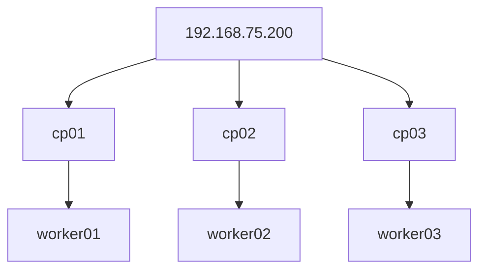

# Talos HA Kubernetes Cluster – Full Guide

This document is a **single-file, end-to-end guide** to build a **production-grade Talos Linux Kubernetes cluster**.

Everything is here:
- Architecture
- Networking
- Patches
- Commands
- Automation (inline)
- Diagrams (Mermaid)
- Add-ons

No external files required.

---

## Cluster Topology

### Control Planes
| Name | IP |
|----|----|
| cp01 | 192.168.75.191 |
| cp02 | 192.168.75.192 |
| cp03 | 192.168.75.193 |
| **VIP** | **192.168.75.200** |

### Workers
| Name | IP |
|----|----|
| worker-01 | 192.168.75.181 |
| worker-02 | 192.168.75.182 |
| worker-03 | 192.168.75.183 |

---

## Architecture Diagram



---

## Prerequisites

- Talos Linux installed on all nodes
- Static IP networking
- macOS/Linux workstation
- kubectl installed

---

## Install talosctl

```bash
wget https://github.com/siderolabs/talos/releases/download/v1.10.9/talosctl-darwin-amd64
chmod +x talosctl-darwin-amd64
mv talosctl-darwin-amd64 /usr/local/bin/talosctl
```

---

## Generate Cluster Configuration

```bash
talosctl gen config "talos-cluster" "https://cp.talos.vaheed.net:6443"   --kubernetes-version v1.33.6
```

Files created:
- controlplane.yaml
- worker.yaml
- talosconfig

---

## Control Plane Patch (cp-patch.yaml)

```yaml
machine:
  network:
    interfaces:
      - interface: eth0
        vip:
          ip: 192.168.75.200

    extraHostEntries:
      - ip: 192.168.75.200
        aliases: ["cp.talos.vaheed.net"]
      - ip: 192.168.75.191
        aliases: ["cp01"]
      - ip: 192.168.75.192
        aliases: ["cp02"]
      - ip: 192.168.75.193
        aliases: ["cp03"]
      - ip: 192.168.75.181
        aliases: ["worker-01"]
      - ip: 192.168.75.182
        aliases: ["worker-02"]
      - ip: 192.168.75.183
        aliases: ["worker-03"]

  registries:
    mirrors:
      docker.io:
        endpoints: ["https://registry.vaheed.net:2053"]
      gcr.io:
        endpoints: ["https://registry.vaheed.net:2083"]
      ghcr.io:
        endpoints: ["https://registry.vaheed.net:2087"]
      quay.io:
        endpoints: ["https://registry.vaheed.net:8443"]
      registry.k8s.io:
        endpoints: ["https://registry.vaheed.net:2096"]

  certSANs:
    - 192.168.75.200
    - cp.talos.vaheed.net
    - 192.168.75.191
    - 192.168.75.192
    - 192.168.75.193

cluster:
  network:
    cni:
      name: none
    dnsDomain: talos.local
```

---

## Worker Patch (worker-patch.yaml)

```yaml
machine:
  network:
    extraHostEntries:
      - ip: 192.168.75.200
        aliases: ["cp.talos.vaheed.net"]
      - ip: 192.168.75.191
        aliases: ["cp01"]
      - ip: 192.168.75.192
        aliases: ["cp02"]
      - ip: 192.168.75.193
        aliases: ["cp03"]
      - ip: 192.168.75.181
        aliases: ["worker-01"]
      - ip: 192.168.75.182
        aliases: ["worker-02"]
      - ip: 192.168.75.183
        aliases: ["worker-03"]

  registries:
    mirrors:
      docker.io:
        endpoints: ["https://registry.vaheed.net:2053"]
      gcr.io:
        endpoints: ["https://registry.vaheed.net:2083"]
      ghcr.io:
        endpoints: ["https://registry.vaheed.net:2087"]
      quay.io:
        endpoints: ["https://registry.vaheed.net:8443"]
      registry.k8s.io:
        endpoints: ["https://registry.vaheed.net:2096"]

cluster:
  network:
    dnsDomain: talos.local
```

---

## Generate Final Node Configs

### Control Planes

```bash
talosctl machineconfig patch controlplane.yaml --patch @cp-patch.yaml --output cp01.yaml

talosctl machineconfig patch cp01.yaml   --patch '[{"op":"replace","path":"/machine/network/interfaces","value":[{"interface":"ens192","dhcp":false,"addresses":["192.168.75.191/24"],"routes":[{"network":"0.0.0.0/0","gateway":"192.168.75.1"}],"vip":{"ip":"192.168.75.200"}}]}]'   --output cp01.yaml
```

Repeat for:
- cp02 → 192.168.75.192
- cp03 → 192.168.75.193

---

## Workers

```bash
talosctl machineconfig patch worker.yaml --patch @worker-patch.yaml --output worker-01.yaml

talosctl machineconfig patch worker-01.yaml   --patch '[{"op":"replace","path":"/machine/network/interfaces","value":[{"interface":"ens192","dhcp":false,"addresses":["192.168.75.181/24"],"routes":[{"network":"0.0.0.0/0","gateway":"192.168.75.1"}]}]}]'   --output worker-01.yaml
```

Repeat for:
- worker-02 → 192.168.75.182
- worker-03 → 192.168.75.183

---

## Apply Configurations

```bash
talosctl apply-config --insecure --nodes 192.168.75.191 --file cp01.yaml
talosctl apply-config --insecure --nodes 192.168.75.192 --file cp02.yaml
talosctl apply-config --insecure --nodes 192.168.75.193 --file cp03.yaml

talosctl apply-config --insecure --nodes 192.168.75.181 --file worker-01.yaml
talosctl apply-config --insecure --nodes 192.168.75.182 --file worker-02.yaml
talosctl apply-config --insecure --nodes 192.168.75.183 --file worker-03.yaml
```

Wait:
```bash
sleep 600
```

---

## Bootstrap Cluster

```bash
talosctl --talosconfig talosconfig bootstrap   --endpoints 192.168.75.191   --nodes 192.168.75.191
```

Verify:
```bash
ping 192.168.75.200
talosctl --talosconfig talosconfig   --endpoints 192.168.75.200   --nodes 192.168.75.200 get members
```

---

## kubeconfig

```bash
talosctl --talosconfig talosconfig kubeconfig .   --nodes 192.168.75.191   --endpoints 192.168.75.191
```

---

## Install Calico

```bash
kubectl --kubeconfig=kubeconfig apply -f   https://raw.githubusercontent.com/projectcalico/calico/v3.30.0/manifests/tigera-operator.yaml

kubectl --kubeconfig=kubeconfig apply -f   https://raw.githubusercontent.com/projectcalico/calico/v3.30.0/manifests/custom-resources.yaml
```

---

## Install MetalLB

```bash
kubectl --kubeconfig=kubeconfig apply -f   https://raw.githubusercontent.com/metallb/metallb/v0.14.8/config/manifests/metallb-native.yaml

sleep 600
```

```bash
kubectl --kubeconfig=kubeconfig apply -f - <<EOF
apiVersion: metallb.io/v1beta1
kind: IPAddressPool
metadata:
  name: production-pool
  namespace: metallb-system
spec:
  addresses:
    - 192.168.75.100-192.168.75.150
---
apiVersion: metallb.io/v1beta1
kind: L2Advertisement
metadata:
  name: l2-advert
  namespace: metallb-system
EOF
```

---

## Storage

```bash
kubectl --kubeconfig=kubeconfig apply -f   https://raw.githubusercontent.com/rancher/local-path-provisioner/master/deploy/local-path-storage.yaml

kubectl --kubeconfig=kubeconfig patch storageclass local-path   -p '{"metadata":{"annotations":{"storageclass.kubernetes.io/is-default-class":"true"}}}'
```

---

## Pod Security

```bash
kubectl --kubeconfig=kubeconfig label namespace default   pod-security.kubernetes.io/enforce=privileged
```

---

## Result

- HA Talos control plane with VIP
- Calico networking
- MetalLB LoadBalancers
- Default storage class
- Private registry mirrors
- Fully reproducible setup
