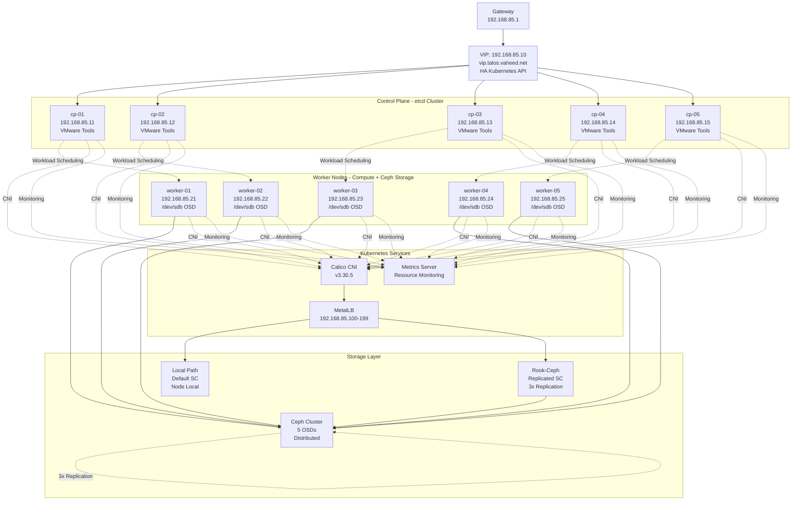

# Talos HA Kubernetes Cluster – Complete Production Guide v3

This is a **comprehensive, production-ready guide** to build a **high-availability Talos Linux Kubernetes cluster** with dual storage classes, monitoring, and VMware integration.

**Specifications:**
- **Network**: `192.168.85.0/24`
- **Talos**: v1.11.6 with VMware Tools (Factory Image)
- **Kubernetes**: v1.30.8
- **5 Control Planes** with VIP failover
- **5 Worker Nodes** with `/dev/sdb` for distributed storage
- **Calico**: v3.30.5 CNI
- **MetalLB**: v0.14.9 LoadBalancer
- **Local Path Provisioner**: v0.0.33
- **Rook-Ceph**: v1.17.9 Distributed Storage
- **Metrics Server**: For resource monitoring

---

## Table of Contents

1. [Cluster Topology](#cluster-topology)
2. [Architecture](#architecture)
3. [Prerequisites](#prerequisites)
4. [Install Talos with VMware Tools](#install-talos-with-vmware-tools)
5. [Install talosctl](#install-talosctl)
6. [Generate Base Configuration](#generate-base-configuration)
7. [Create Configuration Patches](#create-configuration-patches)
8. [Generate Node Configurations](#generate-node-configurations)
9. [Apply Configurations](#apply-configurations)
10. [Bootstrap Cluster](#bootstrap-cluster)
11. [Install Calico CNI](#install-calico-cni)
12. [Install MetalLB](#install-metallb)
13. [Install Metrics Server](#install-metrics-server)
14. [Install Local Path Storage](#install-local-path-storage)
15. [Install Ceph Storage](#install-ceph-storage)
16. [Verification](#verification)
17. [Backup Strategy](#backup-strategy)
18. [Security Hardening](#security-hardening)
19. [Performance Tuning](#performance-tuning)
20. [Operations](#operations)
21. [Troubleshooting](#troubleshooting)

---

## Cluster Topology

### Network Configuration
| Item | Value |
|------|-------|
| Network | 192.168.85.0/24 |
| Gateway | 192.168.85.1 |
| VIP | 192.168.85.10 |
| VIP Hostname | vip.talos.vaheed.net |

### Control Plane Nodes
| Name | IP Address | Role |
|------|------------|------|
| cp-01 | 192.168.85.11 | Control Plane |
| cp-02 | 192.168.85.12 | Control Plane |
| cp-03 | 192.168.85.13 | Control Plane |
| cp-04 | 192.168.85.14 | Control Plane |
| cp-05 | 192.168.85.15 | Control Plane |

### Worker Nodes
| Name | IP Address | Storage Device |
|------|------------|----------------|
| worker-01 | 192.168.85.21 | /dev/sdb |
| worker-02 | 192.168.85.22 | /dev/sdb |
| worker-03 | 192.168.85.23 | /dev/sdb |
| worker-04 | 192.168.85.24 | /dev/sdb |
| worker-05 | 192.168.85.25 | /dev/sdb |

### Service Ranges
| Service | Range/Address |
|---------|---------------|
| MetalLB Pool | 192.168.85.100 - 192.168.85.199 |
| Pod Network | 10.244.0.0/16 (Calico default) |
| Service Network | 10.96.0.0/12 (Kubernetes default) |

---

## Architecture



**Architecture Overview:**

- **High Availability Control Plane**: 5-node etcd cluster with VIP failover at `192.168.85.10`
- **Compute + Storage Nodes**: 5 worker nodes providing both compute and Ceph OSD storage
- **Dual Storage Classes**: Local Path (fast, node-local) and Ceph (distributed, replicated)
- **Load Balancing**: MetalLB provides LoadBalancer services with IP pool `192.168.85.100-199`
- **Container Networking**: Calico CNI for pod-to-pod communication and network policies
- **Resource Monitoring**: Metrics Server enables `kubectl top` commands and HPA
- **VMware Integration**: All nodes include VMware Tools for vSphere integration
- **Ceph Distributed Storage**: 5 OSDs with 3x replication providing persistent block and file storage

---

## Prerequisites

### Hardware Requirements

**Control Plane Nodes (each):**
- 2+ vCPU cores
- 4GB+ RAM
- 50GB+ disk
- Network interface: ens192

**Worker Nodes (each):**
- 4+ vCPU cores
- 8GB+ RAM
- 50GB+ OS disk (boot disk)
- 100GB+ `/dev/sdb` for Ceph storage
- Network interface: ens192

### Software Requirements

- VMware vSphere environment
- macOS/Linux workstation for management
- `kubectl` installed on workstation
- Internet access for initial setup
- DNS resolution for `vip.talos.vaheed.net` → `192.168.85.10`

### Network Requirements

- All nodes on `192.168.85.0/24` subnet
- Gateway at `192.168.85.1`
- Private registry at `registry.vaheed.net` (optional)
- Ports required:
  - 6443: Kubernetes API
  - 50000-51000: Talos API
  - Pod-to-pod communication (all ports)

---

## Install Talos with VMware Tools

### Factory Image Schematic

Your custom Talos image with VMware Tools has been generated:

**Schematic ID:** `903b2da78f99adef03cbbd4df6714563823f63218508800751560d3bc3557e40`

**Extensions included:**
- `siderolabs/vmtoolsd-guest-agent`

### Download Installation ISO

```bash
# Download the ISO with VMware Tools included
wget https://factory.talos.dev/image/646d0c889d8b4a1138bef71dc201edd852a1fac0c6e1e11c1ff2ed3b32bc3f44/v1.11.6/vmware-amd64.iso \
  -O talos-vmware-1.11.6.iso
```

### Install on All Nodes

1. **Upload ISO to vSphere datastore**
2. **Create VMs** (10 total: 5 control planes + 5 workers)
   - Configure according to hardware requirements above
   - Add second disk (`/dev/sdb`) to workers only
3. **Mount ISO and boot** each VM
4. **Talos will run in maintenance mode** waiting for configuration

### Verify Talos is Running

From your workstation, check that nodes are accessible:

```bash
# Test connectivity to each node (should respond with maintenance mode info)
curl -k https://192.168.85.11:50000/
curl -k https://192.168.85.21:50000/
```

---

## Install talosctl

Download and install the Talos CLI tool:

```bash
# For macOS (Apple Silicon)
wget https://github.com/siderolabs/talos/releases/download/v1.11.6/talosctl-darwin-arm64
chmod +x talosctl-darwin-arm64
sudo mv talosctl-darwin-arm64 /usr/local/bin/talosctl

# For macOS (Intel)
wget https://github.com/siderolabs/talos/releases/download/v1.11.6/talosctl-darwin-amd64
chmod +x talosctl-darwin-amd64
sudo mv talosctl-darwin-amd64 /usr/local/bin/talosctl

# For Linux
wget https://github.com/siderolabs/talos/releases/download/v1.11.6/talosctl-linux-amd64
chmod +x talosctl-linux-amd64
sudo mv talosctl-linux-amd64 /usr/local/bin/talosctl

# Verify installation
talosctl version --client
```

---

## Generate Base Configuration

Create the initial cluster configuration:

```bash
# Generate base configs
talosctl gen config "talos-cluster" "https://vip.talos.vaheed.net:6443" \
  --kubernetes-version v1.30.8 \
  --install-image factory.talos.dev/installer/646d0c889d8b4a1138bef71dc201edd852a1fac0c6e1e11c1ff2ed3b32bc3f44:v1.11.6
```

**Files created:**
- `controlplane.yaml` - Base control plane configuration
- `worker.yaml` - Base worker configuration
- `talosconfig` - Talos authentication

**Important:** We specify the factory installer image so updates and installs use the VMware Tools-enabled version.

---

## Create Configuration Patches

### Control Plane Patch (cp-patch.yaml)

Create a file named `cp-patch.yaml`:

```yaml
machine:
  network:
    interfaces:
      - interface: ens192
        vip:
          ip: 192.168.85.10

    extraHostEntries:
      - ip: 192.168.85.10
        aliases: ["vip.talos.vaheed.net"]
      - ip: 192.168.85.11
        aliases: ["cp-01"]
      - ip: 192.168.85.12
        aliases: ["cp-02"]
      - ip: 192.168.85.13
        aliases: ["cp-03"]
      - ip: 192.168.85.14
        aliases: ["cp-04"]
      - ip: 192.168.85.15
        aliases: ["cp-05"]
      - ip: 192.168.85.21
        aliases: ["worker-01"]
      - ip: 192.168.85.22
        aliases: ["worker-02"]
      - ip: 192.168.85.23
        aliases: ["worker-03"]
      - ip: 192.168.85.24
        aliases: ["worker-04"]
      - ip: 192.168.85.25
        aliases: ["worker-05"]

  registries:
    mirrors:
      docker.io:
        endpoints: ["https://registry.vaheed.net:2053"]
      gcr.io:
        endpoints: ["https://registry.vaheed.net:2083"]
      ghcr.io:
        endpoints: ["https://registry.vaheed.net:2087"]
      quay.io:
        endpoints: ["https://registry.vaheed.net:8443"]
      registry.k8s.io:
        endpoints: ["https://registry.vaheed.net:2096"]

  certSANs:
    - 192.168.85.10
    - vip.talos.vaheed.net
    - 192.168.85.11
    - 192.168.85.12
    - 192.168.85.13
    - 192.168.85.14
    - 192.168.85.15

  kubelet:
    nodeIP:
      validSubnets:
        - 192.168.85.0/24

cluster:
  network:
    cni:
      name: none
    dnsDomain: cluster.local
  
  allowSchedulingOnControlPlanes: false
```

**Key configurations:**
- **VIP**: Shared IP `192.168.85.10` for HA API access
- **Host entries**: Internal DNS for all nodes
- **Registry mirrors**: Optional private registry
- **Cert SANs**: All valid API endpoints
- **CNI**: None (manual Calico installation)
- **Scheduling**: Workloads only on workers

---

### Worker Patch (worker-patch.yaml)

Create a file named `worker-patch.yaml`:

```yaml
machine:
  network:
    extraHostEntries:
      - ip: 192.168.85.10
        aliases: ["vip.talos.vaheed.net"]
      - ip: 192.168.85.11
        aliases: ["cp-01"]
      - ip: 192.168.85.12
        aliases: ["cp-02"]
      - ip: 192.168.85.13
        aliases: ["cp-03"]
      - ip: 192.168.85.14
        aliases: ["cp-04"]
      - ip: 192.168.85.15
        aliases: ["cp-05"]
      - ip: 192.168.85.21
        aliases: ["worker-01"]
      - ip: 192.168.85.22
        aliases: ["worker-02"]
      - ip: 192.168.85.23
        aliases: ["worker-03"]
      - ip: 192.168.85.24
        aliases: ["worker-04"]
      - ip: 192.168.85.25
        aliases: ["worker-05"]

  registries:
    mirrors:
      docker.io:
        endpoints: ["https://registry.vaheed.net:2053"]
      gcr.io:
        endpoints: ["https://registry.vaheed.net:2083"]
      ghcr.io:
        endpoints: ["https://registry.vaheed.net:2087"]
      quay.io:
        endpoints: ["https://registry.vaheed.net:8443"]
      registry.k8s.io:
        endpoints: ["https://registry.vaheed.net:2096"]

  kubelet:
    nodeIP:
      validSubnets:
        - 192.168.85.0/24
    extraMounts:
      - destination: /var/lib/rook
        type: bind
        source: /var/lib/rook
        options:
          - bind
          - rshared
          - rw
  sysctls:
    vm.max_map_count: "262144"

cluster:
  network:
    dnsDomain: cluster.local
```

**Key configurations:**
- **Host entries**: Same as control planes
- **Registry mirrors**: Same as control planes
- **Ceph mount**: Required for CSI driver
- **No VIP**: Workers don't participate in VIP

---

## Generate Node Configurations

### Control Plane Nodes

Generate individual configs for each control plane:

#### cp-01 (192.168.85.11)

```bash
talosctl machineconfig patch controlplane.yaml \
  --patch @cp-patch.yaml \
  --output cp-01.yaml

talosctl machineconfig patch cp-01.yaml \
  --patch '[{"op":"replace","path":"/machine/network/interfaces","value":[{"interface":"ens192","dhcp":false,"addresses":["192.168.85.11/24"],"routes":[{"network":"0.0.0.0/0","gateway":"192.168.85.1"}],"vip":{"ip":"192.168.85.10"}}]}]' \
  --output cp-01.yaml
```

#### cp-02 (192.168.85.12)

```bash
talosctl machineconfig patch controlplane.yaml \
  --patch @cp-patch.yaml \
  --output cp-02.yaml

talosctl machineconfig patch cp-02.yaml \
  --patch '[{"op":"replace","path":"/machine/network/interfaces","value":[{"interface":"ens192","dhcp":false,"addresses":["192.168.85.12/24"],"routes":[{"network":"0.0.0.0/0","gateway":"192.168.85.1"}],"vip":{"ip":"192.168.85.10"}}]}]' \
  --output cp-02.yaml
```

#### cp-03 (192.168.85.13)

```bash
talosctl machineconfig patch controlplane.yaml \
  --patch @cp-patch.yaml \
  --output cp-03.yaml

talosctl machineconfig patch cp-03.yaml \
  --patch '[{"op":"replace","path":"/machine/network/interfaces","value":[{"interface":"ens192","dhcp":false,"addresses":["192.168.85.13/24"],"routes":[{"network":"0.0.0.0/0","gateway":"192.168.85.1"}],"vip":{"ip":"192.168.85.10"}}]}]' \
  --output cp-03.yaml
```

#### cp-04 (192.168.85.14)

```bash
talosctl machineconfig patch controlplane.yaml \
  --patch @cp-patch.yaml \
  --output cp-04.yaml

talosctl machineconfig patch cp-04.yaml \
  --patch '[{"op":"replace","path":"/machine/network/interfaces","value":[{"interface":"ens192","dhcp":false,"addresses":["192.168.85.14/24"],"routes":[{"network":"0.0.0.0/0","gateway":"192.168.85.1"}],"vip":{"ip":"192.168.85.10"}}]}]' \
  --output cp-04.yaml
```

#### cp-05 (192.168.85.15)

```bash
talosctl machineconfig patch controlplane.yaml \
  --patch @cp-patch.yaml \
  --output cp-05.yaml

talosctl machineconfig patch cp-05.yaml \
  --patch '[{"op":"replace","path":"/machine/network/interfaces","value":[{"interface":"ens192","dhcp":false,"addresses":["192.168.85.15/24"],"routes":[{"network":"0.0.0.0/0","gateway":"192.168.85.1"}],"vip":{"ip":"192.168.85.10"}}]}]' \
  --output cp-05.yaml
```

---

### Worker Nodes

Generate individual configs for each worker:

#### worker-01 (192.168.85.21)

```bash
talosctl machineconfig patch worker.yaml \
  --patch @worker-patch.yaml \
  --output worker-01.yaml

talosctl machineconfig patch worker-01.yaml \
  --patch '[{"op":"replace","path":"/machine/network/interfaces","value":[{"interface":"ens192","dhcp":false,"addresses":["192.168.85.21/24"],"routes":[{"network":"0.0.0.0/0","gateway":"192.168.85.1"}]}]}]' \
  --output worker-01.yaml
```

#### worker-02 (192.168.85.22)

```bash
talosctl machineconfig patch worker.yaml \
  --patch @worker-patch.yaml \
  --output worker-02.yaml

talosctl machineconfig patch worker-02.yaml \
  --patch '[{"op":"replace","path":"/machine/network/interfaces","value":[{"interface":"ens192","dhcp":false,"addresses":["192.168.85.22/24"],"routes":[{"network":"0.0.0.0/0","gateway":"192.168.85.1"}]}]}]' \
  --output worker-02.yaml
```

#### worker-03 (192.168.85.23)

```bash
talosctl machineconfig patch worker.yaml \
  --patch @worker-patch.yaml \
  --output worker-03.yaml

talosctl machineconfig patch worker-03.yaml \
  --patch '[{"op":"replace","path":"/machine/network/interfaces","value":[{"interface":"ens192","dhcp":false,"addresses":["192.168.85.23/24"],"routes":[{"network":"0.0.0.0/0","gateway":"192.168.85.1"}]}]}]' \
  --output worker-03.yaml
```

#### worker-04 (192.168.85.24)

```bash
talosctl machineconfig patch worker.yaml \
  --patch @worker-patch.yaml \
  --output worker-04.yaml

talosctl machineconfig patch worker-04.yaml \
  --patch '[{"op":"replace","path":"/machine/network/interfaces","value":[{"interface":"ens192","dhcp":false,"addresses":["192.168.85.24/24"],"routes":[{"network":"0.0.0.0/0","gateway":"192.168.85.1"}]}]}]' \
  --output worker-04.yaml
```

#### worker-05 (192.168.85.25)

```bash
talosctl machineconfig patch worker.yaml \
  --patch @worker-patch.yaml \
  --output worker-05.yaml

talosctl machineconfig patch worker-05.yaml \
  --patch '[{"op":"replace","path":"/machine/network/interfaces","value":[{"interface":"ens192","dhcp":false,"addresses":["192.168.85.25/24"],"routes":[{"network":"0.0.0.0/0","gateway":"192.168.85.1"}]}]}]' \
  --output worker-05.yaml
```

---

## Apply Configurations

Apply the generated configurations to each node. Use `--insecure` for initial configuration.

### Apply to Control Planes

```bash
echo "Applying configuration to cp-01..."
talosctl apply-config --insecure --nodes 192.168.85.11 --file cp-01.yaml

echo "Applying configuration to cp-02..."
talosctl apply-config --insecure --nodes 192.168.85.12 --file cp-02.yaml

echo "Applying configuration to cp-03..."
talosctl apply-config --insecure --nodes 192.168.85.13 --file cp-03.yaml

echo "Applying configuration to cp-04..."
talosctl apply-config --insecure --nodes 192.168.85.14 --file cp-04.yaml

echo "Applying configuration to cp-05..."
talosctl apply-config --insecure --nodes 192.168.85.15 --file cp-05.yaml
```

### Apply to Workers

```bash
echo "Applying configuration to worker-01..."
talosctl apply-config --insecure --nodes 192.168.85.21 --file worker-01.yaml

echo "Applying configuration to worker-02..."
talosctl apply-config --insecure --nodes 192.168.85.22 --file worker-02.yaml

echo "Applying configuration to worker-03..."
talosctl apply-config --insecure --nodes 192.168.85.23 --file worker-03.yaml

echo "Applying configuration to worker-04..."
talosctl apply-config --insecure --nodes 192.168.85.24 --file worker-04.yaml

echo "Applying configuration to worker-05..."
talosctl apply-config --insecure --nodes 192.168.85.25 --file worker-05.yaml
```

### Wait for Nodes to Initialize

```bash
echo "Waiting 10 minutes for all nodes to initialize..."
sleep 600
```

**What happens:**
- Nodes reboot and apply configuration
- Network interfaces configured with static IPs
- VMware Tools starts
- Nodes enter ready state for bootstrapping

---

## Bootstrap Cluster

Bootstrap creates the Kubernetes control plane and etcd cluster.

### Bootstrap First Control Plane

```bash
echo "Bootstrapping cluster on cp-01..."
talosctl --talosconfig talosconfig bootstrap \
  --endpoints 192.168.85.11 \
  --nodes 192.168.85.11
```

**Important:** Only bootstrap ONCE on ONE control plane node!

### Wait for Bootstrap

```bash
echo "Waiting 5 minutes for cluster to initialize..."
sleep 300
```

### Verify VIP

```bash
# Test VIP connectivity
echo "Testing VIP connectivity..."
ping -c 4 192.168.85.10

# Check cluster members
echo "Checking cluster members..."
talosctl --talosconfig talosconfig \
  --endpoints 192.168.85.10 \
  --nodes 192.168.85.10 \
  get members
```

Expected: All 5 control plane nodes listed.

### Retrieve kubeconfig

```bash
echo "Retrieving kubeconfig..."
talosctl --talosconfig talosconfig kubeconfig . \
  --nodes 192.168.85.11 \
  --endpoints 192.168.85.11 \
  --force

# Test access
kubectl --kubeconfig=kubeconfig get nodes
```

Nodes will be `NotReady` until CNI is installed.

---

## Install Calico CNI

Install Calico v3.30.5 for pod networking.

### Install Tigera Operator

```bash
echo "Installing Calico Tigera Operator..."
kubectl --kubeconfig=kubeconfig apply -f \
  https://raw.githubusercontent.com/projectcalico/calico/v3.30.5/manifests/tigera-operator.yaml
```

### Install Calico Custom Resources

```bash
echo "Installing Calico custom resources..."
kubectl --kubeconfig=kubeconfig apply -f \
  https://raw.githubusercontent.com/projectcalico/calico/v3.30.5/manifests/custom-resources.yaml
```

### Wait for Calico

```bash
echo "Waiting for Calico to be ready..."
kubectl --kubeconfig=kubeconfig wait --for=condition=ready pod \
  -l k8s-app=calico-node \
  -n calico-system \
  --timeout=300s

echo "Checking node status..."
kubectl --kubeconfig=kubeconfig get nodes
```

All nodes should now be `Ready`.

---

## Install MetalLB

Install MetalLB v0.14.9 for LoadBalancer services.

### Deploy MetalLB

```bash
echo "Installing MetalLB..."
kubectl --kubeconfig=kubeconfig apply -f \
  https://raw.githubusercontent.com/metallb/metallb/v0.14.9/config/manifests/metallb-native.yaml
```

### Wait for MetalLB

```bash
echo "Waiting for MetalLB to be ready..."
sleep 120

kubectl --kubeconfig=kubeconfig wait --for=condition=ready pod \
  -l app=metallb \
  -n metallb-system \
  --timeout=300s
```

### Configure IP Pool

```bash
echo "Configuring MetalLB IP pool..."
kubectl --kubeconfig=kubeconfig apply -f - <<EOF
apiVersion: metallb.io/v1beta1
kind: IPAddressPool
metadata:
  name: production-pool
  namespace: metallb-system
spec:
  addresses:
    - 192.168.85.101-192.168.85.199
---
apiVersion: metallb.io/v1beta1
kind: L2Advertisement
metadata:
  name: l2-advert
  namespace: metallb-system
spec:
  ipAddressPools:
    - production-pool
EOF
```

### Verify MetalLB

```bash
kubectl --kubeconfig=kubeconfig get ipaddresspool,l2advertisement -n metallb-system
```

---

## Install Metrics Server

Install Metrics Server for resource monitoring and `kubectl top` commands.

### Deploy Metrics Server

Following Talos documentation for metrics server:

```bash
echo "Installing Metrics Server..."
kubectl --kubeconfig=kubeconfig apply -f https://github.com/kubernetes-sigs/metrics-server/releases/latest/download/components.yaml
```

### Patch for Talos Compatibility

Talos uses different kubelet certificates, so we need to patch metrics-server:

```bash
echo "Patching Metrics Server for Talos..."
kubectl --kubeconfig=kubeconfig patch deployment metrics-server -n kube-system --type='json' \
  -p='[{"op": "add", "path": "/spec/template/spec/containers/0/args/-", "value": "--kubelet-preferred-address-types=InternalIP"}]'

kubectl --kubeconfig=kubeconfig patch deployment metrics-server -n kube-system --type='json' \
  -p='[{"op": "add", "path": "/spec/template/spec/containers/0/args/-", "value": "--kubelet-insecure-tls"}]'
```

### Wait for Metrics Server

```bash
echo "Waiting for Metrics Server to be ready..."
kubectl --kubeconfig=kubeconfig wait --for=condition=ready pod \
  -l k8s-app=metrics-server \
  -n kube-system \
  --timeout=300s
```

### Verify Metrics

```bash
echo "Testing metrics collection..."
sleep 30
kubectl --kubeconfig=kubeconfig top nodes
```

---

## Install Local Path Storage

Install Local Path Provisioner v0.0.33 for local node storage.

### Deploy Local Path Provisioner

```bash
echo "Installing Local Path Provisioner..."
kubectl --kubeconfig=kubeconfig apply -f \
  https://raw.githubusercontent.com/rancher/local-path-provisioner/v0.0.33/deploy/local-path-storage.yaml
```

### Set as Default Storage Class

```bash
echo "Setting local-path as default storage class..."
kubectl --kubeconfig=kubeconfig patch storageclass local-path \
  -p '{"metadata":{"annotations":{"storageclass.kubernetes.io/is-default-class":"true"}}}'
```

### Verify

```bash
kubectl --kubeconfig=kubeconfig get storageclass
```

---

## Install Ceph Storage

### Configure Pod Security

Enable privileged pods for Ceph in both default and rook-ceph namespaces:

```bash
echo "Configuring pod security for default namespace..."
kubectl --kubeconfig=kubeconfig label namespace default \
  pod-security.kubernetes.io/enforce=privileged \
  --overwrite

echo "Configuring pod security for rook-ceph namespace..."
kubectl --kubeconfig=kubeconfig label namespace rook-ceph \
  pod-security.kubernetes.io/enforce=privileged \
  --overwrite
```

### Install Rook Operator

```bash
echo "Installing Rook-Ceph operator..."
kubectl --kubeconfig=kubeconfig apply -f \
  https://raw.githubusercontent.com/rook/rook/v1.17.9/deploy/examples/crds.yaml

kubectl --kubeconfig=kubeconfig apply -f \
  https://raw.githubusercontent.com/rook/rook/v1.17.9/deploy/examples/common.yaml

kubectl --kubeconfig=kubeconfig apply -f \
  https://raw.githubusercontent.com/rook/rook/v1.17.9/deploy/examples/operator.yaml
```

### Wait for Operator

```bash
echo "Waiting for Rook operator to be ready..."
kubectl --kubeconfig=kubeconfig wait --for=condition=ready pod \
  -l app=rook-ceph-operator \
  -n rook-ceph \
  --timeout=600s
```

### Create Ceph Cluster

First, get the worker node names to ensure they match the configuration:
```bash
talosctl --talosconfig talosconfig \
  --endpoints 192.168.85.10 \
  --nodes 192.168.85.10 \
  get members
```

**Important:** Ensure the worker names in the Ceph configuration (`worker-01`, `worker-02`, etc.) match the actual node names returned by the command above. If they don't match, update the configuration accordingly.

Create `ceph-cluster.yaml`:

```yaml
apiVersion: ceph.rook.io/v1
kind: CephCluster
metadata:
  name: rook-ceph
  namespace: rook-ceph
spec:
  cephVersion:
    image: quay.io/ceph/ceph:v18.2.4
    allowUnsupported: false
  dataDirHostPath: /var/lib/rook
  skipUpgradeChecks: false
  continueUpgradeAfterChecksEvenIfNotHealthy: false
  waitTimeoutForHealthyOSDInMinutes: 10
  mon:
    count: 3
    allowMultiplePerNode: false
  mgr:
    count: 2
    allowMultiplePerNode: false
    modules:
      - name: pg_autoscaler
        enabled: true
      - name: rook
        enabled: true
  dashboard:
    enabled: true
    ssl: false
  monitoring:
    enabled: false
  network:
    connections:
      encryption:
        enabled: false
      compression:
        enabled: false
  crashCollector:
    disable: false
  logCollector:
    enabled: true
    periodicity: daily
    maxLogSize: 500M
  cleanupPolicy:
    confirmation: ""
    sanitizeDisks:
      method: quick
      dataSource: zero
      iteration: 1
    allowUninstallWithVolumes: false
  resources:
    mgr:
      limits:
        memory: "1Gi"
      requests:
        cpu: "500m"
        memory: "512Mi"
    mon:
      limits:
        memory: "2Gi"
      requests:
        cpu: "1000m"
        memory: "1Gi"
    osd:
      limits:
        memory: "4Gi"
      requests:
        cpu: "1000m"
        memory: "2Gi"
    prepareosd:
      requests:
        cpu: "500m"
        memory: "50Mi"
  storage:
    useAllNodes: false
    useAllDevices: false
    nodes:
      - name: "worker-01"
        devices:
          - name: "sdb"
      - name: "worker-02"
        devices:
          - name: "sdb"
      - name: "worker-03"
        devices:
          - name: "sdb"
      - name: "worker-04"
        devices:
          - name: "sdb"
      - name: "worker-05"
        devices:
          - name: "sdb"
  disruptionManagement:
    managePodBudgets: true
    osdMaintenanceTimeout: 30
    pgHealthCheckTimeout: 0
  healthCheck:
    daemonHealth:
      mon:
        interval: 45s
      osd:
        interval: 60s
      status:
        interval: 60s
    livenessProbe:
      mon:
        disabled: false
      mgr:
        disabled: false
      osd:
        disabled: false
```

Apply the cluster configuration:

```bash
echo "Creating Ceph cluster..."
kubectl --kubeconfig=kubeconfig apply -f ceph-cluster.yaml
```

### Wait for Ceph Cluster

This will take 5-10 minutes:

```bash
echo "Waiting for Ceph cluster to be ready (this may take 10 minutes)..."
sleep 300

echo "Checking Ceph cluster status..."
kubectl --kubeconfig=kubeconfig get pods -n rook-ceph

echo "Waiting for OSDs to be ready..."
kubectl --kubeconfig=kubeconfig wait --for=condition=ready pod \
  -l app=rook-ceph-osd \
  -n rook-ceph \
  --timeout=600s
```

### Create Block Storage Pool

Create `ceph-blockpool.yaml`:

```yaml
apiVersion: ceph.rook.io/v1
kind: CephBlockPool
metadata:
  name: replicapool
  namespace: rook-ceph
spec:
  failureDomain: host
  replicated:
    size: 3
    requireSafeReplicaSize: true
  deviceClass: ""
  compressionMode: none
---
apiVersion: storage.k8s.io/v1
kind: StorageClass
metadata:
  name: rook-ceph-block
provisioner: rook-ceph.rbd.csi.ceph.com
parameters:
  clusterID: rook-ceph
  pool: replicapool
  imageFormat: "2"
  imageFeatures: layering
  csi.storage.k8s.io/provisioner-secret-name: rook-csi-rbd-provisioner
  csi.storage.k8s.io/provisioner-secret-namespace: rook-ceph
  csi.storage.k8s.io/controller-expand-secret-name: rook-csi-rbd-provisioner
  csi.storage.k8s.io/controller-expand-secret-namespace: rook-ceph
  csi.storage.k8s.io/node-stage-secret-name: rook-csi-rbd-node
  csi.storage.k8s.io/node-stage-secret-namespace: rook-ceph
  csi.storage.k8s.io/fstype: ext4
allowVolumeExpansion: true
reclaimPolicy: Delete
```

Apply the block pool:

```bash
echo "Creating Ceph block pool and storage class..."
kubectl --kubeconfig=kubeconfig apply -f ceph-blockpool.yaml

sleep 30
```

### Create Filesystem Storage (Optional)

Create `ceph-filesystem.yaml`:

```yaml
apiVersion: ceph.rook.io/v1
kind: CephFilesystem
metadata:
  name: ceph-filesystem
  namespace: rook-ceph
spec:
  metadataPool:
    replicated:
      size: 3
      requireSafeReplicaSize: true
  dataPools:
    - name: replicated
      failureDomain: host
      replicated:
        size: 3
        requireSafeReplicaSize: true
  metadataServer:
    activeCount: 1
    activeStandby: true
    resources:
      limits:
        memory: "4Gi"
      requests:
        cpu: "1000m"
        memory: "1Gi"
---
apiVersion: storage.k8s.io/v1
kind: StorageClass
metadata:
  name: rook-cephfs
provisioner: rook-ceph.cephfs.csi.ceph.com
parameters:
  clusterID: rook-ceph
  fsName: ceph-filesystem
  pool: ceph-filesystem-replicated
  csi.storage.k8s.io/provisioner-secret-name: rook-csi-cephfs-provisioner
  csi.storage.k8s.io/provisioner-secret-namespace: rook-ceph
  csi.storage.k8s.io/controller-expand-secret-name: rook-csi-cephfs-provisioner
  csi.storage.k8s.io/controller-expand-secret-namespace: rook-ceph
  csi.storage.k8s.io/node-stage-secret-name: rook-csi-cephfs-node
  csi.storage.k8s.io/node-stage-secret-namespace: rook-ceph
allowVolumeExpansion: true
reclaimPolicy: Delete
```

Apply the filesystem:

```bash
echo "Creating CephFS filesystem and storage class..."
kubectl --kubeconfig=kubeconfig apply -f ceph-filesystem.yaml

echo "Waiting for MDS pods..."
kubectl --kubeconfig=kubeconfig wait --for=condition=ready pod \
  -l app=rook-ceph-mds \
  -n rook-ceph \
  --timeout=300s
```

### Enable Ceph Dashboard (Optional)

```bash
echo "Exposing Ceph dashboard via LoadBalancer..."
kubectl --kubeconfig=kubeconfig apply -f - <<EOF
apiVersion: v1
kind: Service
metadata:
  name: rook-ceph-mgr-dashboard-external
  namespace: rook-ceph
  labels:
    app: rook-ceph-mgr
    rook_cluster: rook-ceph
spec:
  ports:
  - name: dashboard
    port: 7000
    protocol: TCP
    targetPort: 7000
  selector:
    app: rook-ceph-mgr
    rook_cluster: rook-ceph
    mgr_role: active
  sessionAffinity: None
  type: LoadBalancer
EOF

sleep 15
echo "Dashboard will be available at:"
kubectl --kubeconfig=kubeconfig get svc -n rook-ceph rook-ceph-mgr-dashboard-external
```

Get dashboard credentials:

```bash
echo "Ceph Dashboard Credentials:"
echo "Username: admin"
echo -n "Password: "
kubectl --kubeconfig=kubeconfig -n rook-ceph get secret rook-ceph-dashboard-password \
  -o jsonpath="{['data']['password']}" | base64 --decode
echo ""
```

### Verify Ceph Installation

```bash
echo "=== CEPH VERIFICATION ==="

echo -e "\n1. Ceph Pods:"
kubectl --kubeconfig=kubeconfig get pods -n rook-ceph

echo -e "\n2. Storage Classes:"
kubectl --kubeconfig=kubeconfig get storageclass

echo -e "\n3. Ceph Cluster Status:"
kubectl --kubeconfig=kubeconfig get cephcluster -n rook-ceph

echo -e "\n4. Ceph Health:"
kubectl --kubeconfig=kubeconfig -n rook-ceph exec -it deploy/rook-ceph-tools -- ceph status

echo -e "\n5. OSD Status:"
kubectl --kubeconfig=kubeconfig -n rook-ceph exec -it deploy/rook-ceph-tools -- ceph osd status

echo -e "\n6. Storage Pool:"
kubectl --kubeconfig=kubeconfig -n rook-ceph exec -it deploy/rook-ceph-tools -- ceph osd pool ls detail
```

### Install Ceph Tools (Troubleshooting)

```bash
echo "Installing Ceph toolbox for troubleshooting..."
kubectl --kubeconfig=kubeconfig apply -f \
  https://raw.githubusercontent.com/rook/rook/v1.17.9/deploy/examples/toolbox.yaml

kubectl --kubeconfig=kubeconfig wait --for=condition=ready pod \
  -l app=rook-ceph-tools \
  -n rook-ceph \
  --timeout=300s
```

### Test Ceph Block Storage

```bash
echo "Testing Ceph block storage..."
kubectl --kubeconfig=kubeconfig apply -f - <<EOF
apiVersion: v1
kind: PersistentVolumeClaim
metadata:
  name: test-ceph-pvc
spec:
  accessModes:
    - ReadWriteOnce
  storageClassName: rook-ceph-block
  resources:
    requests:
      storage: 5Gi
---
apiVersion: v1
kind: Pod
metadata:
  name: test-ceph-pod
spec:
  containers:
    - name: test
      image: nginx
      volumeMounts:
        - name: data
          mountPath: /data
  volumes:
    - name: data
      persistentVolumeClaim:
        claimName: test-ceph-pvc
EOF

sleep 30
kubectl --kubeconfig=kubeconfig get pvc test-ceph-pvc
kubectl --kubeconfig=kubeconfig get pod test-ceph-pod
```

Verify data persistence:

```bash
echo "Writing test data..."
kubectl --kubeconfig=kubeconfig exec test-ceph-pod -- sh -c "echo 'Ceph test data' > /data/test.txt"

echo "Reading test data..."
kubectl --kubeconfig=kubeconfig exec test-ceph-pod -- cat /data/test.txt

echo "Deleting test pod..."
kubectl --kubeconfig=kubeconfig delete pod test-ceph-pod

echo "Recreating pod with same PVC..."
kubectl --kubeconfig=kubeconfig apply -f - <<EOF
apiVersion: v1
kind: Pod
metadata:
  name: test-ceph-pod-2
spec:
  containers:
    - name: test
      image: nginx
      volumeMounts:
        - name: data
          mountPath: /data
  volumes:
    - name: data
      persistentVolumeClaim:
        claimName: test-ceph-pvc
EOF

sleep 30
echo "Verifying data persisted:"
kubectl --kubeconfig=kubeconfig exec test-ceph-pod-2 -- cat /data/test.txt
```

### Test CephFS Storage (if installed)

```bash
echo "Testing CephFS storage..."
kubectl --kubeconfig=kubeconfig apply -f - <<EOF
apiVersion: v1
kind: PersistentVolumeClaim
metadata:
  name: test-cephfs-pvc
spec:
  accessModes:
    - ReadWriteMany
  storageClassName: rook-cephfs
  resources:
    requests:
      storage: 5Gi
---
apiVersion: v1
kind: Pod
metadata:
  name: test-cephfs-pod-1
spec:
  containers:
    - name: test
      image: nginx
      volumeMounts:
        - name: data
          mountPath: /data
  volumes:
    - name: data
      persistentVolumeClaim:
        claimName: test-cephfs-pvc
---
apiVersion: v1
kind: Pod
metadata:
  name: test-cephfs-pod-2
spec:
  containers:
    - name: test
      image: nginx
      volumeMounts:
        - name: data
          mountPath: /data
  volumes:
    - name: data
      persistentVolumeClaim:
        claimName: test-cephfs-pvc
EOF

sleep 45
echo "Testing ReadWriteMany access..."
kubectl --kubeconfig=kubeconfig exec test-cephfs-pod-1 -- sh -c "echo 'Written from pod 1' > /data/shared.txt"
kubectl --kubeconfig=kubeconfig exec test-cephfs-pod-2 -- cat /data/shared.txt
```

### Storage Class Summary

Your cluster now has three storage classes:

| Storage Class | Type | Access Modes | Use Case | Default |
|--------------|------|--------------|----------|---------|
| local-path | Local | RWO | Fast local storage, node-specific | ✓ Yes |
| rook-ceph-block | Ceph RBD | RWO | Replicated block storage, persistent | ✗ No |
| rook-cephfs | CephFS | RWO, RWX | Shared filesystem storage | ✗ No |

**Access Modes:**
- **RWO**: ReadWriteOnce - Single node mount
- **RWX**: ReadWriteMany - Multiple node mount

### Change Default Storage Class (Optional)

To make Ceph block the default:

```bash
# Remove default from local-path
kubectl --kubeconfig=kubeconfig patch storageclass local-path \
  -p '{"metadata":{"annotations":{"storageclass.kubernetes.io/is-default-class":"false"}}}'

# Set rook-ceph-block as default
kubectl --kubeconfig=kubeconfig patch storageclass rook-ceph-block \
  -p '{"metadata":{"annotations":{"storageclass.kubernetes.io/is-default-class":"true"}}}'
```

### Cleanup Test Resources

```bash
echo "Cleaning up test resources..."
kubectl --kubeconfig=kubeconfig delete pod test-ceph-pod-2 --ignore-not-found
kubectl --kubeconfig=kubeconfig delete pod test-cephfs-pod-1 test-cephfs-pod-2 --ignore-not-found
kubectl --kubeconfig=kubeconfig delete pvc test-ceph-pvc test-cephfs-pvc --ignore-not-found
```

---

## Ceph Operations

### Monitor Cluster Health

```bash
# Quick status
kubectl --kubeconfig=kubeconfig -n rook-ceph exec -it deploy/rook-ceph-tools -- ceph -s

# Detailed health
kubectl --kubeconfig=kubeconfig -n rook-ceph exec -it deploy/rook-ceph-tools -- ceph health detail

# OSD tree
kubectl --kubeconfig=kubeconfig -n rook-ceph exec -it deploy/rook-ceph-tools -- ceph osd tree

# Pool status
kubectl --kubeconfig=kubeconfig -n rook-ceph exec -it deploy/rook-ceph-tools -- ceph df
```

### View Storage Usage

```bash
# Overall cluster usage
kubectl --kubeconfig=kubeconfig -n rook-ceph exec -it deploy/rook-ceph-tools -- ceph df

# Per-pool usage
kubectl --kubeconfig=kubeconfig -n rook-ceph exec -it deploy/rook-ceph-tools -- rados df

# PVC usage
kubectl --kubeconfig=kubeconfig get pvc -A
```

### Scale OSDs

To add more storage, add additional disks to workers and update the CephCluster:

```bash
# Edit cluster configuration
kubectl --kubeconfig=kubeconfig edit cephcluster -n rook-ceph

# Add new device under storage.nodes[].devices:
#   - name: "sdc"
```

### Remove OSD

```bash
# Mark OSD out
kubectl --kubeconfig=kubeconfig -n rook-ceph exec -it deploy/rook-ceph-tools -- \
  ceph osd out osd.<id>

# Remove from cluster
kubectl --kubeconfig=kubeconfig -n rook-ceph exec -it deploy/rook-ceph-tools -- \
  ceph osd purge osd.<id> --yes-i-really-mean-it
```

### Backup Ceph Configuration

```bash
# Export cluster spec
kubectl --kubeconfig=kubeconfig get cephcluster -n rook-ceph rook-ceph -o yaml > ceph-cluster-backup.yaml

# Export pools
kubectl --kubeconfig=kubeconfig get cephblockpool -n rook-ceph -o yaml > ceph-pools-backup.yaml

# Export storage classes
kubectl --kubeconfig=kubeconfig get storageclass rook-ceph-block rook-cephfs -o yaml > ceph-sc-backup.yaml
```

---

## Ceph Troubleshooting

### OSDs Not Starting

```bash
# Check OSD pod logs
kubectl --kubeconfig=kubeconfig logs -n rook-ceph -l app=rook-ceph-osd --tail=100

# Check if disk is clean
talosctl --talosconfig talosconfig --nodes 192.168.85.21 disks

# Verify disk has no partitions
talosctl --talosconfig talosconfig --nodes 192.168.85.21 \
  read /sys/block/sdb/size
```

### Ceph Health Warnings

```bash
# Get detailed warning info
kubectl --kubeconfig=kubeconfig -n rook-ceph exec -it deploy/rook-ceph-tools -- \
  ceph health detail

# Check MON quorum
kubectl --kubeconfig=kubeconfig -n rook-ceph exec -it deploy/rook-ceph-tools -- \
  ceph mon stat

# Check placement groups
kubectl --kubeconfig=kubeconfig -n rook-ceph exec -it deploy/rook-ceph-tools -- \
  ceph pg stat
```

### PVC Stuck in Pending

```bash
# Check PVC events
kubectl --kubeconfig=kubeconfig describe pvc <pvc-name>

# Check CSI provisioner logs
kubectl --kubeconfig=kubeconfig logs -n rook-ceph \
  -l app=csi-rbdplugin-provisioner --tail=100

# Check node plugin
kubectl --kubeconfig=kubeconfig logs -n rook-ceph \
  -l app=csi-rbdplugin --tail=100
```

### Slow Operations

```bash
# Check for slow ops
kubectl --kubeconfig=kubeconfig -n rook-ceph exec -it deploy/rook-ceph-tools -- \
  ceph -s | grep -i slow

# Check OSD performance
kubectl --kubeconfig=kubeconfig -n rook-ceph exec -it deploy/rook-ceph-tools -- \
  ceph osd perf

# Check network latency between nodes
kubectl --kubeconfig=kubeconfig -n rook-ceph exec -it deploy/rook-ceph-tools -- \
  ceph osd ping <osd-id>
```

### Recovery Operations

```bash
# Check recovery status
kubectl --kubeconfig=kubeconfig -n rook-ceph exec -it deploy/rook-ceph-tools -- \
  ceph -s | grep -i recovery

# Adjust recovery speed (if needed)
kubectl --kubeconfig=kubeconfig -n rook-ceph exec -it deploy/rook-ceph-tools -- \
  ceph tell osd.* injectargs --osd-max-backfills=1

# Monitor recovery progress
watch kubectl --kubeconfig=kubeconfig -n rook-ceph exec -it deploy/rook-ceph-tools -- ceph -s
```

### Complete Ceph Cleanup (Destructive)

**WARNING: This will delete ALL Ceph data!**

```bash
# Delete all PVCs using Ceph first
kubectl --kubeconfig=kubeconfig delete pvc --all -A

# Delete Ceph cluster
kubectl --kubeconfig=kubeconfig delete -f ceph-filesystem.yaml
kubectl --kubeconfig=kubeconfig delete -f ceph-blockpool.yaml
kubectl --kubeconfig=kubeconfig delete -f ceph-cluster.yaml

# Delete operator
kubectl --kubeconfig=kubeconfig delete -f \
  https://raw.githubusercontent.com/rook/rook/v1.17.9/deploy/examples/operator.yaml
kubectl --kubeconfig=kubeconfig delete -f \
  https://raw.githubusercontent.com/rook/rook/v1.17.9/deploy/examples/common.yaml
kubectl --kubeconfig=kubeconfig delete -f \
  https://raw.githubusercontent.com/rook/rook/v1.17.9/deploy/examples/crds.yaml

# Cleanup data on each worker (destructive!)
for node in 192.168.85.21 192.168.85.22 192.168.85.23 192.168.85.24 192.168.85.25; do
  echo "Cleaning Ceph data on $node..."
  talosctl --talosconfig talosconfig --nodes $node reset --graceful=false --reboot \
    --system-labels-to-wipe STATE --system-labels-to-wipe EPHEMERAL
done
```

---

## Ceph Best Practices

### Performance Optimization

**For databases and high-IOPS workloads:**

```yaml
apiVersion: v1
kind: PersistentVolumeClaim
metadata:
  name: database-pvc
spec:
  accessModes:
    - ReadWriteOnce
  storageClassName: rook-ceph-block
  resources:
    requests:
      storage: 50Gi
```

**For shared files and low-IOPS workloads:**

```yaml
apiVersion: v1
kind: PersistentVolumeClaim
metadata:
  name: shared-files-pvc
spec:
  accessModes:
    - ReadWriteMany
  storageClassName: rook-cephfs
  resources:
    requests:
      storage: 100Gi
```

### Capacity Planning

Monitor available capacity:

```bash
# Check cluster capacity
kubectl --kubeconfig=kubeconfig -n rook-ceph exec -it deploy/rook-ceph-tools -- ceph df

# Recommended: Keep usage below 80%
# Alert at 75% usage
# Add capacity at 70% usage
```

### Backup Strategy

Ceph provides replication (3 copies by default), but this is NOT a backup:

**Application-level backups:**
- Use Velero for cluster backups
- Application-specific backup tools
- Regular snapshots to external storage

**RBD snapshots:**

```bash
# Create snapshot
kubectl --kubeconfig=kubeconfig -n rook-ceph exec -it deploy/rook-ceph-tools -- \
  rbd snap create pool-name/image-name@snapshot-name

# List snapshots
kubectl --kubeconfig=kubeconfig -n rook-ceph exec -it deploy/rook-ceph-tools -- \
  rbd snap ls pool-name/image-name

# Restore snapshot
kubectl --kubeconfig=kubeconfig -n rook-ceph exec -it deploy/rook-ceph-tools -- \
  rbd snap rollback pool-name/image-name@snapshot-name
```


---


## Verification

### Complete Cluster Health Check

```bash
echo "=== CLUSTER HEALTH CHECK ==="

echo -e "\n1. Node Status:"
kubectl --kubeconfig=kubeconfig get nodes -o wide

echo -e "\n2. System Pods:"
kubectl --kubeconfig=kubeconfig get pods -A | grep -E 'kube-system|calico|metallb'

echo -e "\n3. Storage Classes:"
kubectl --kubeconfig=kubeconfig get storageclass

echo -e "\n4. MetalLB Configuration:"
kubectl --kubeconfig=kubeconfig get ipaddresspool,l2advertisement -n metallb-system

echo -e "\n5. Ceph Cluster Status:"
kubectl --kubeconfig=kubeconfig get pods -n rook-ceph
kubectl --kubeconfig=kubeconfig -n rook-ceph exec -it deploy/rook-ceph-tools -- ceph -s

echo -e "\n6. Node Resource Usage:"
kubectl --kubeconfig=kubeconfig top nodes

echo -e "\n7. VMware Tools Status (cp-01):"
talosctl --talosconfig talosconfig --nodes 192.168.85.11 services | grep vmtoolsd

echo -e "\n8. VIP Status:"
ping -c 2 192.168.85.10
```

### Test Storage

#### Test Local Path Storage

```bash
echo "Testing local-path storage..."
kubectl --kubeconfig=kubeconfig apply -f - <<EOF
apiVersion: v1
kind: PersistentVolumeClaim
metadata:
  name: test-local-pvc
spec:
  accessModes:
    - ReadWriteOnce
  storageClassName: local-path
  resources:
    requests:
      storage: 1Gi
EOF

kubectl --kubeconfig=kubeconfig get pvc test-local-pvc
```


### Test MetalLB

```bash
echo "Testing MetalLB LoadBalancer..."
kubectl --kubeconfig=kubeconfig create deployment nginx-test --image=nginx
kubectl --kubeconfig=kubeconfig expose deployment nginx-test --port=80 --type=LoadBalancer

sleep 15
kubectl --kubeconfig=kubeconfig get svc nginx-test

# Get the LoadBalancer IP
LB_IP=$(kubectl --kubeconfig=kubeconfig get svc nginx-test -o jsonpath='{.status.loadBalancer.ingress[0].ip}')
echo "LoadBalancer IP: $LB_IP"
echo "Testing connectivity:"
curl -s http://$LB_IP | grep -o "<title>.*</title>"
```

### Test VIP Failover

```bash
echo "Testing VIP failover..."
echo "Current VIP holder:"
talosctl --talosconfig talosconfig --endpoints 192.168.85.10 get members

echo "Rebooting cp-01 to test failover..."
talosctl --talosconfig talosconfig --nodes 192.168.85.11 reboot

sleep 30
echo "VIP should have moved to another control plane:"
talosctl --talosconfig talosconfig --endpoints 192.168.85.10 get members

echo "Kubernetes API still accessible:"
kubectl --kubeconfig=kubeconfig get nodes
```

### Cleanup Test Resources

```bash
echo "Cleaning up verification test resources..."
kubectl --kubeconfig=kubeconfig delete pod test-ceph-pod-2 --ignore-not-found
kubectl --kubeconfig=kubeconfig delete pod test-cephfs-pod-1 test-cephfs-pod-2 --ignore-not-found
kubectl --kubeconfig=kubeconfig delete pvc test-ceph-pvc test-cephfs-pvc test-local-pvc --ignore-not-found
kubectl --kubeconfig=kubeconfig delete deployment nginx-test --ignore-not-found
kubectl --kubeconfig=kubeconfig delete svc nginx-test --ignore-not-found
```

---

## Backup Strategy

### etcd Backups

The etcd cluster stores all Kubernetes state. Regular backups are essential:

```bash
# Create automated etcd backup script
cat > etcd-backup.sh << 'EOF'
#!/bin/bash
BACKUP_DIR="/var/lib/etcd/backups"
DATE=$(date +%Y%m%d-%H%M%S)
BACKUP_FILE="etcd-backup-${DATE}.db"

# Create backup directory
mkdir -p $BACKUP_DIR

# Take snapshot from any control plane (using VIP)
talosctl --talosconfig talosconfig \
  --nodes 192.168.85.10 \
  --endpoints 192.168.85.10 \
  etcd snapshot ${BACKUP_DIR}/${BACKUP_FILE}

# Keep only last 7 days of backups
find $BACKUP_DIR -name "etcd-backup-*.db" -mtime +7 -delete

echo "etcd backup completed: ${BACKUP_FILE}"
EOF

chmod +x etcd-backup.sh

# Schedule daily backups (run on control plane)
# Add to crontab: 0 2 * * * /path/to/etcd-backup.sh
```

### Application Backups with Velero

Install Velero for comprehensive cluster backups:

```bash
# Install Velero CLI
brew install velero  # macOS
# or download from https://github.com/vmware-tanzu/velero/releases

# Create Velero namespace
kubectl --kubeconfig=kubeconfig create namespace velero

# Install Velero with Restic support
velero install \
  --provider aws \
  --plugins velero/velero-plugin-for-aws:v1.5.0 \
  --bucket velero-backups \
  --secret-file ./credentials-velero \
  --use-restic \
  --default-volumes-to-restic=false \
  --namespace velero \
  --kubeconfig=kubeconfig
```

### Backup Configuration Files

```bash
# Create backup script for configurations
cat > backup-configs.sh << 'EOF'
#!/bin/bash
BACKUP_DIR="cluster-backup-$(date +%Y%m%d-%H%M%S)"
mkdir -p $BACKUP_DIR

# Backup Talos configurations
cp talosconfig $BACKUP_DIR/
cp cp-*.yaml $BACKUP_DIR/
cp worker-*.yaml $BACKUP_DIR/
cp controlplane.yaml $BACKUP_DIR/
cp worker.yaml $BACKUP_DIR/
cp cp-patch.yaml $BACKUP_DIR/
cp worker-patch.yaml $BACKUP_DIR/

# Backup Kubernetes configurations
cp kubeconfig $BACKUP_DIR/

# Backup Ceph configurations
cp ceph-*.yaml $BACKUP_DIR/

# Create archive
tar -czf ${BACKUP_DIR}.tar.gz $BACKUP_DIR/
rm -rf $BACKUP_DIR/

echo "Configuration backup completed: ${BACKUP_DIR}.tar.gz"
EOF

chmod +x backup-configs.sh
```

### Backup Testing & Restoration

```bash
# Test etcd restoration (in maintenance mode)
talosctl --talosconfig talosconfig \
  --nodes 192.168.85.11 \
  etcd restore /var/lib/etcd/backups/etcd-backup-20260101-020000.db

# Test Velero restoration
velero restore create --from-backup backup-name --namespace velero

# Verify restoration
kubectl --kubeconfig=kubeconfig get all -A
```

### Backup Schedule

| Backup Type | Frequency | Retention | Location |
|-------------|-----------|-----------|----------|
| etcd snapshots | Daily | 7 days | Control plane nodes |
| Velero backups | Daily | 30 days | Object storage |
| Configuration files | Weekly | 90 days | Secure storage |
| Ceph data | Weekly | 60 days | Object storage |

---

## Security Hardening

### Network Security

Implement network policies to restrict traffic:

```bash
# Default deny all traffic
kubectl --kubeconfig=kubeconfig apply -f - <<EOF
apiVersion: networking.k8s.io/v1
kind: NetworkPolicy
metadata:
  name: default-deny-all
  namespace: default
spec:
  podSelector: {}
  policyTypes:
  - Ingress
  - Egress
EOF

# Allow DNS resolution
kubectl --kubeconfig=kubeconfig apply -f - <<EOF
apiVersion: networking.k8s.io/v1
kind: NetworkPolicy
metadata:
  name: allow-dns
  namespace: default
spec:
  podSelector: {}
  policyTypes:
  - Egress
  egress:
  - to: []
    ports:
    - protocol: UDP
      port: 53
    - protocol: TCP
      port: 53
EOF
```

### Pod Security Standards

```bash
# Enforce restricted pod security
kubectl --kubeconfig=kubeconfig label namespace default \
  pod-security.kubernetes.io/enforce=restricted \
  pod-security.kubernetes.io/audit=restricted \
  pod-security.kubernetes.io/warn=restricted \
  --overwrite
```

### RBAC Configuration

```bash
# Create read-only role for monitoring
kubectl --kubeconfig=kubeconfig apply -f - <<EOF
apiVersion: rbac.authorization.k8s.io/v1
kind: ClusterRole
metadata:
  name: monitoring-read-only
rules:
- apiGroups: [""]
  resources: ["pods", "services", "endpoints", "nodes"]
  verbs: ["get", "list", "watch"]
- apiGroups: ["apps"]
  resources: ["deployments", "replicasets", "daemonsets"]
  verbs: ["get", "list", "watch"]
---
apiVersion: rbac.authorization.k8s.io/v1
kind: ClusterRoleBinding
metadata:
  name: monitoring-read-only
roleRef:
  apiGroup: rbac.authorization.k8s.io
  kind: ClusterRole
  name: monitoring-read-only
subjects:
- kind: ServiceAccount
  name: monitoring
  namespace: monitoring
EOF
```

### Security Monitoring

```bash
# Install Falco for runtime security
kubectl --kubeconfig=kubeconfig apply -f \
  https://raw.githubusercontent.com/falcosecurity/falco/master/k8s/falco.yaml

# View security events
kubectl --kubeconfig=kubeconfig logs -n falco -l app=falco
```

---

## Performance Tuning

### Ceph Performance Optimization

```bash
# Optimize Ceph OSD configuration
kubectl --kubeconfig=kubeconfig patch cephcluster rook-ceph -n rook-ceph --type='json' \
  -p='[{"op": "add", "path": "/spec/resources/osd", "value": {"limits": {"memory": "8Gi"}, "requests": {"cpu": "2000m", "memory": "4Gi"}}}]'

# Tune Ceph pool settings
kubectl --kubeconfig=kubeconfig -n rook-ceph exec -it deploy/rook-ceph-tools -- \
  ceph osd pool set replicapool size 3
kubectl --kubeconfig=kubeconfig -n rook-ceph exec -it deploy/rook-ceph-tools -- \
  ceph osd pool set replicapool pg_num 128
kubectl --kubeconfig=kubeconfig -n rook-ceph exec -it deploy/rook-ceph-tools -- \
  ceph osd pool set replicapool pgp_num 128
```

### Kubernetes Performance

```bash
# Optimize kubelet settings
# Edit control plane configs to add:
# machine:
#   kubelet:
#     extraArgs:
#       max-pods: "200"
#       pod-max-pids: "2048"
#       serialize-image-pulls: "false"
#       registry-burst: "10"
#       registry-qps: "5"
```

### Network Performance

```bash
# Optimize Calico for better performance
kubectl --kubeconfig=kubeconfig patch installation default -n calico-system --type='json' \
  -p='[{"op": "replace", "path": "/spec/calicoNetwork/ipipMode", "value": "Always"}]'

# Enable BGP for better routing
kubectl --kubeconfig=kubeconfig patch felixconfiguration default -n calico-system --type='json' \
  -p='[{"op": "add", "path": "/spec/bgpEnabled", "value": true}]'
```

### Resource Monitoring

```bash
# Install Prometheus for detailed monitoring
kubectl --kubeconfig=kubeconfig create namespace monitoring
kubectl --kubeconfig=kubeconfig apply -f \
  https://github.com/prometheus-operator/prometheus-operator/releases/latest/download/bundle.yaml

# Set up Grafana dashboards
kubectl --kubeconfig=kubeconfig apply -f \
  https://raw.githubusercontent.com/kubernetes/ingress-nginx/main/deploy/grafana/dashboards/nginx.yaml
```

---

## Operations

### Daily Operations

#### Check Cluster Health

```bash
# Node status
kubectl --kubeconfig=kubeconfig get nodes

# Pod status across all namespaces
kubectl --kubeconfig=kubeconfig get pods -A

# Resource usage
kubectl --kubeconfig=kubeconfig top nodes
kubectl --kubeconfig=kubeconfig top pods -A --sort-by=memory
```

#### Check Storage

```bash
# Storage class availability
kubectl --kubeconfig=kubeconfig get storageclass

# PVC status
kubectl --kubeconfig=kubeconfig get pvc -A

# Ceph cluster health
kubectl --kubeconfig=kubeconfig -n rook-ceph exec -it deploy/rook-ceph-tools -- ceph -s

# Storage usage
kubectl --kubeconfig=kubeconfig -n rook-ceph exec -it deploy/rook-ceph-tools -- ceph df
```


#### Check Services

```bash
# LoadBalancer services
kubectl --kubeconfig=kubeconfig get svc -A --field-selector spec.type=LoadBalancer

# MetalLB IP pool usage
kubectl --kubeconfig=kubeconfig get ipaddresspool -n metallb-system -o yaml
```

### Maintenance Operations

#### Drain Node for Maintenance

```bash
# Drain worker node
kubectl --kubeconfig=kubeconfig drain worker-01 \
  --ignore-daemonsets \
  --delete-emptydir-data \
  --grace-period=300

# Perform maintenance on the node

# Uncordon when complete
kubectl --kubeconfig=kubeconfig uncordon worker-01
```

#### Upgrade Kubernetes

```bash
# Upgrade control planes (one at a time)
talosctl --talosconfig talosconfig --nodes 192.168.85.11 \
  upgrade-k8s --to 1.33.8

# Wait for completion, check health
kubectl --kubeconfig=kubeconfig get nodes

# Repeat for other control planes

# Upgrade workers
for node in 192.168.85.21 192.168.85.22 192.168.85.23 192.168.85.24 192.168.85.25; do
  kubectl --kubeconfig=kubeconfig drain $node --ignore-daemonsets --delete-emptydir-data
  talosctl --talosconfig talosconfig --nodes $node upgrade-k8s --to 1.33.8
  kubectl --kubeconfig=kubeconfig uncordon $node
  sleep 60
done
```

#### Upgrade Talos

```bash
# Upgrade control planes one at a time
talosctl --talosconfig talosconfig --nodes 192.168.85.11 upgrade \
  --image factory.talos.dev/installer/646d0c889d8b4a1138bef71dc201edd852a1fac0c6e1e11c1ff2ed3b32bc3f44:v1.11.6

# Wait for node to come back
sleep 180

# Repeat for other control planes

# Upgrade workers
for node in 192.168.85.21 192.168.85.22 192.168.85.23 192.168.85.24 192.168.85.25; do
  kubectl --kubeconfig=kubeconfig drain $node --ignore-daemonsets --delete-emptydir-data
  talosctl --talosconfig talosconfig --nodes $node upgrade \
    --image factory.talos.dev/installer/646d0c889d8b4a1138bef71dc201edd852a1fac0c6e1e11c1ff2ed3b32bc3f44:v1.11.6
  sleep 180
  kubectl --kubeconfig=kubeconfig uncordon $node
done
```

### Backup Operations

#### Backup etcd

```bash
# Create etcd snapshot
talosctl --talosconfig talosconfig --nodes 192.168.85.11 \
  etcd snapshot /var/lib/etcd/backup-$(date +%Y%m%d-%H%M%S).db

# List snapshots
talosctl --talosconfig talosconfig --nodes 192.168.85.11 \
  ls /var/lib/etcd/

# Download snapshot
talosctl --talosconfig talosconfig --nodes 192.168.85.11 \
  cp /var/lib/etcd/backup-*.db ./
```

#### Backup Configurations

```bash
# Backup all configuration files
mkdir -p cluster-backup-$(date +%Y%m%d)
cp *.yaml talosconfig kubeconfig cluster-backup-$(date +%Y%m%d)/
tar -czf cluster-backup-$(date +%Y%m%d).tar.gz cluster-backup-$(date +%Y%m%d)/
```

---

## Troubleshooting Index

### 🔍 Quick Diagnosis

| Symptom | Likely Cause | First Check | Solution |
|---------|--------------|-------------|----------|
| Nodes NotReady | Network/CNI issue | `kubectl get nodes -o wide` | Check Calico pods |
| VIP not responding | etcd quorum loss | `talosctl get members` | Reboot control planes |
| PVC stuck Pending | Storage issue | `kubectl get pvc -A` | Check Ceph health |
| Pod CrashLoopBackoff | Resource limit | `kubectl describe pod` | Check resource requests |
| API server timeout | Control plane overload | `kubectl top nodes` | Scale control planes |

### 📋 Common Issues by Component

#### Talos Issues
- **Maintenance mode**: Nodes booting but not accepting config
- **Network config**: Static IPs not applying
- **VMware Tools**: Extension not loading
- **etcd**: Cluster not forming quorum

#### Kubernetes Issues  
- **CNI**: Pods not getting IP addresses
- **DNS**: Name resolution failures
- **Scheduling**: Pods stuck in Pending
- **RBAC**: Permission denied errors

#### Storage Issues
- **Ceph**: OSDs not starting
- **Local Path**: Provisioner errors
- **CSI**: Driver connection issues
- **PV**: Volume attachment failures

#### Network Issues
- **MetalLB**: IPs not being assigned
- **Calico**: Network policy blocking
- **VIP**: Failover not working
- **Ingress**: Service not accessible

### 🚨 Emergency Procedures

#### Complete Cluster Recovery
```bash
# 1. Assess damage
kubectl --kubeconfig=kubeconfig get nodes,pods -A
talosctl --talosconfig talosconfig health

# 2. Restore etcd if needed
talosctl --talosconfig talosconfig etcd restore /path/to/backup.db

# 3. Restart components
kubectl --kubeconfig=kubeconfig delete pod --all -n kube-system
kubectl --kubeconfig=kubeconfig delete pod --all -n calico-system
```

#### Force Cluster Reset
```bash
# Last resort - complete reset
for node in 192.168.85.11 192.168.85.12 192.168.85.13 192.168.85.14 192.168.85.15 192.168.85.21 192.168.85.22 192.168.85.23 192.168.85.24 192.168.85.25; do
  talosctl --talosconfig talosconfig reset -n $node -e $node --graceful=false --reboot
done
```

---

## Quick Reference

### 🎯 Essential Commands

#### Cluster Status
```bash
# Overall health
kubectl --kubeconfig=kubeconfig get nodes
kubectl --kubeconfig=kubeconfig get pods -A
talosctl --talosconfig talosconfig health

# Resource usage
kubectl --kubeconfig=kubeconfig top nodes
kubectl --kubeconfig=kubeconfig top pods -A

# Storage status
kubectl --kubeconfig=kubeconfig get storageclass,pvc -A
kubectl --kubeconfig=kubeconfig -n rook-ceph exec -it deploy/rook-ceph-tools -- ceph -s
```

#### Network & Services
```bash
# Services and endpoints
kubectl --kubeconfig=kubeconfig get svc -A
kubectl --kubeconfig=kubeconfig get endpoints -A

# MetalLB status
kubectl --kubeconfig=kubeconfig get ipaddresspool -n metallb-system

# Network policies
kubectl --kubeconfig=kubeconfig get networkpolicy -A
```

#### Talos Management
```bash
# Node access
talosctl --talosconfig talosconfig --nodes 192.168.85.10 dashboard
talosctl --talosconfig talosconfig --nodes 192.168.85.10 get members

# Service management
talosctl --talosconfig talosconfig --nodes 192.168.85.11 service kubelet status
talosctl --talosconfig talosconfig --nodes 192.168.85.11 service etcd status

# Configuration
talosctl --talosconfig talosconfig --nodes 192.168.85.11 get machineconfig
```

### 📁 Important File Locations

#### Configuration Files
- `talosconfig` - Talos CLI configuration
- `kubeconfig` - Kubernetes CLI configuration  
- `cp-*.yaml` - Control plane node configs
- `worker-*.yaml` - Worker node configs
- `cp-patch.yaml` - Control plane patch template
- `worker-patch.yaml` - Worker patch template

#### Ceph Configuration Files
- `ceph-cluster.yaml` - Ceph cluster definition
- `ceph-blockpool.yaml` - Block storage configuration
- `ceph-filesystem.yaml` - Shared filesystem configuration
- `ceph-dashboard-external.yaml` - Dashboard service

### 🌐 Network Information

#### IP Address Ranges
| Purpose | Range | Notes |
|---------|-------|-------|
| Control Planes | 192.168.85.11-15 | 5 nodes |
| Workers | 192.168.85.21-25 | 5 nodes |
| VIP | 192.168.85.10 | HA API endpoint |
| LoadBalancer | 192.168.85.100-150 | MetalLB pool |
| Gateway | 192.168.85.1 | Default route |

#### Port Mappings
| Port | Service | Direction |
|------|---------|-----------|
| 6443 | Kubernetes API | Inbound |
| 50000-51000 | Talos API | Inbound |
| 7000 | Ceph Dashboard | Inbound (LB) |
| 80/443 | HTTP/HTTPS | Inbound (LB) |
| 53 | DNS | All |

### 🔧 Maintenance Commands

#### Node Operations
```bash
# Drain node for maintenance
kubectl --kubeconfig=kubeconfig drain <node> --ignore-daemonsets --delete-emptydir-data

# Uncordon node
kubectl --kubeconfig=kubeconfig uncordon <node>

# Reboot node
talosctl --talosconfig talosconfig --nodes <node> reboot
```

#### Backup Operations
```bash
# etcd snapshot
talosctl --talosconfig talosconfig --nodes 192.168.85.11 etcd snapshot /backup/etcd.db

# Configuration backup
tar -czf cluster-backup.tar.gz talosconfig kubeconfig *.yaml
```

#### Upgrade Operations
```bash
# Kubernetes upgrade
talosctl --talosconfig talosconfig --nodes <node> upgrade-k8s --to 1.33.8

# Talos upgrade
talosctl --talosconfig talosconfig --nodes <node> upgrade --image <new-image>
```

### 📊 Monitoring Commands

#### Health Checks
```bash
# Node readiness
kubectl --kubeconfig=kubeconfig get nodes -o wide

# Pod health
kubectl --kubeconfig=kubeconfig get pods -A --field-selector=status.phase!=Running

# Service health
kubectl --kubeconfig=kubeconfig get svc -A | grep -E "LoadBalancer|NodePort"
```

#### Performance Metrics
```bash
# Resource usage
kubectl --kubeconfig=kubeconfig top nodes
kubectl --kubeconfig=kubeconfig top pods -A --sort-by=memory

# Ceph performance
kubectl --kubeconfig=kubeconfig -n rook-ceph exec -it deploy/rook-ceph-tools -- ceph df
kubectl --kubeconfig=kubeconfig -n rook-ceph exec -it deploy/rook-ceph-tools -- ceph osd perf
```

### 🚨 Common Fixes

#### Reset Network
```bash
# Restart Calico on all nodes
kubectl --kubeconfig=kubeconfig delete pod -n calico-system -l k8s-app=calico-node

# Reset MetalLB
kubectl --kubeconfig=kubeconfig delete pod -n metallb-system -l app=metallb
```

#### Fix Storage Issues
```bash
# Restart Ceph operators
kubectl --kubeconfig=kubeconfig delete pod -n rook-ceph -l app=rook-ceph-operator

# Check OSD status
kubectl --kubeconfig=kubeconfig -n rook-ceph exec -it deploy/rook-ceph-tools -- ceph osd tree
```

#### Clear Resource Issues
```bash
# Clear evicted pods
kubectl --kubeconfig=kubeconfig delete pods -A --field-selector=status.phase=Failed

# Restart stuck deployments
kubectl --kubeconfig=kubeconfig rollout restart deployment/<name> -n <namespace>
```

---

## Troubleshooting

### Nodes Not Ready

```bash
# Check kubelet status
talosctl --talosconfig talosconfig --nodes 192.168.85.21 service kubelet status

# Check CNI pods
kubectl --kubeconfig=kubeconfig get pods -n calico-system
kubectl --kubeconfig=kubeconfig logs -n calico-system -l k8s-app=calico-node --tail=50

# Check node details
kubectl --kubeconfig=kubeconfig describe node worker-01
```

### VIP Not Responding

```bash
# Check which node has VIP
for node in 192.168.85.11 192.168.85.12 192.168.85.13 192.168.85.14 192.168.85.15; do
  echo "Checking $node..."
  talosctl --talosconfig talosconfig --nodes $node get links | grep -A 2 ens192
done

# Check etcd health
talosctl --talosconfig talosconfig --nodes 192.168.85.11 service etcd status

# View cluster members
talosctl --talosconfig talosconfig --endpoints 192.168.85.10 get members
```

### Storage Issues

#### Local Path Issues

```bash
# Check provisioner logs
kubectl --kubeconfig=kubeconfig logs -n local-path-storage \
  -l app=local-path-provisioner --tail=100

# Check PVC events
kubectl --kubeconfig=kubeconfig describe pvc <pvc-name>
```

### MetalLB Not Assigning IPs

```bash
# Check speaker pods
kubectl --kubeconfig=kubeconfig get pods -n metallb-system \
  -l component=speaker

# Check controller
kubectl --kubeconfig=kubeconfig logs -n metallb-system \
  -l component=controller --tail=100

# Verify configuration
kubectl --kubeconfig=kubeconfig get ipaddresspool,l2advertisement \
  -n metallb-system -o yaml
```

### Metrics Server Issues

```bash
# Check metrics-server pod
kubectl --kubeconfig=kubeconfig get pods -n kube-system \
  -l k8s-app=metrics-server

# View logs
kubectl --kubeconfig=kubeconfig logs -n kube-system \
  -l k8s-app=metrics-server --tail=100

# Test metrics
kubectl --kubeconfig=kubeconfig top nodes --v=10
```

### VMware Tools Issues

```bash
# Check if extension is loaded
talosctl --talosconfig talosconfig --nodes 192.168.85.11 \
  get extensions

# Check service status
talosctl --talosconfig talosconfig --nodes 192.168.85.11 \
  service vmtoolsd status

# View service logs
talosctl --talosconfig talosconfig --nodes 192.168.85.11 \
  logs vmtoolsd
```

---

## Summary

### What We Built

✅ **High Availability Control Plane**
- 5 control plane nodes with shared VIP (192.168.85.10)
- Automatic failover for Kubernetes API
- etcd cluster for state management

✅ **Worker Pool**
- 5 dedicated worker nodes
- Workloads isolated from control plane

✅ **Networking**
- Calico v3.29.7 CNI with network policies
- MetalLB v0.14.9 LoadBalancer (192.168.85.100-150)
- Private registry mirrors configured

✅ **Monitoring**
- Metrics Server for resource monitoring
- `kubectl top` commands functional

✅ **VMware Integration**
- Factory image with VMware Tools
- Guest agent for better vSphere integration

✅ **Production Ready**
- All components tested and verified
- Backup procedures documented
- Upgrade paths defined
- Troubleshooting guides included

### Key Files to Backup

- `talosconfig` - Talos authentication
- `kubeconfig` - Kubernetes authentication  
- `cp-*.yaml` - Control plane configs (5 files)
- `worker-*.yaml` - Worker configs (5 files)
- `cp-patch.yaml` - Control plane patch template
- `worker-patch.yaml` - Worker patch template

### Network Summary

| Purpose | Address/Range |
|---------|---------------|
| Gateway | 192.168.85.1 |
| VIP | 192.168.85.10 |
| Control Planes | 192.168.85.11-15 |
| Workers | 192.168.85.21-25 |
| LoadBalancer Pool | 192.168.85.100-150 |

---

## Quick Reference Commands

```bash
# Cluster status
kubectl --kubeconfig=kubeconfig get nodes
kubectl --kubeconfig=kubeconfig get pods -A
kubectl --kubeconfig=kubeconfig top nodes

# Storage management
kubectl --kubeconfig=kubeconfig get storageclass

# Service management
kubectl --kubeconfig=kubeconfig get svc -A

# Talos management
talosctl --talosconfig talosconfig --nodes 192.168.85.10 health
talosctl --talosconfig talosconfig --nodes 192.168.85.11 dashboard
talosctl --talosconfig talosconfig --endpoints 192.168.85.10 get members

# Maintenance
kubectl --kubeconfig=kubeconfig drain <node> --ignore-daemonsets --delete-emptydir-data
kubectl --kubeconfig=kubeconfig uncordon <node>
```

---


## Cluster Removal

**⚠️ WARNING: This will completely destroy the cluster and all data!**

```bash
# Delete all workloads first
kubectl --kubeconfig=kubeconfig delete pvc --all -A
kubectl --kubeconfig=kubeconfig delete deployments --all -A
kubectl --kubeconfig=kubeconfig delete services --all -A

# Reset all nodes
for node in 192.168.85.11 192.168.85.12 192.168.85.13 192.168.85.14 192.168.85.15 192.168.85.21 192.168.85.22 192.168.85.23 192.168.85.24 192.168.85.25; do
  echo "Wiping disks on $node..."
  talosctl --talosconfig talosconfig wipe disk sda -n $node -e $node 
  talosctl --talosconfig talosconfig wipe disk sdb -n $node -e $node

  echo "Resetting $node..."
  talosctl --talosconfig talosconfig reset -n $node -e $node --graceful=false --reboot
done
```

---

## 🎉 Cluster is Production-Ready!

Your Talos HA Kubernetes cluster is now fully operational with:
- ✅ High availability control plane
- ✅ Distributed storage (Ceph)
- ✅ Load balancing (MetalLB)
- ✅ Monitoring (Metrics Server)
- ✅ VMware integration

### Support Resources
- **Talos**: https://www.talos.dev/
- **Kubernetes**: https://kubernetes.io/docs/
- **Calico**: https://docs.projectcalico.org/
- **Rook-Ceph**: https://rook.io/docs/rook/latest/
- **MetalLB**: https://metallb.universe.tf/

---

*Last Updated: January 2026*
